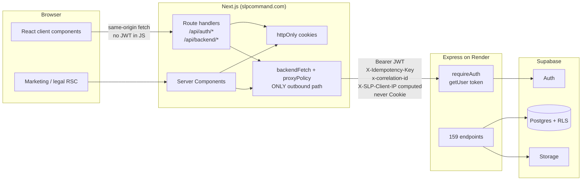
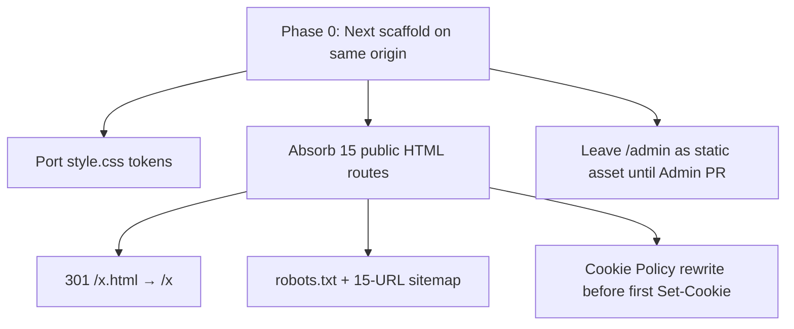
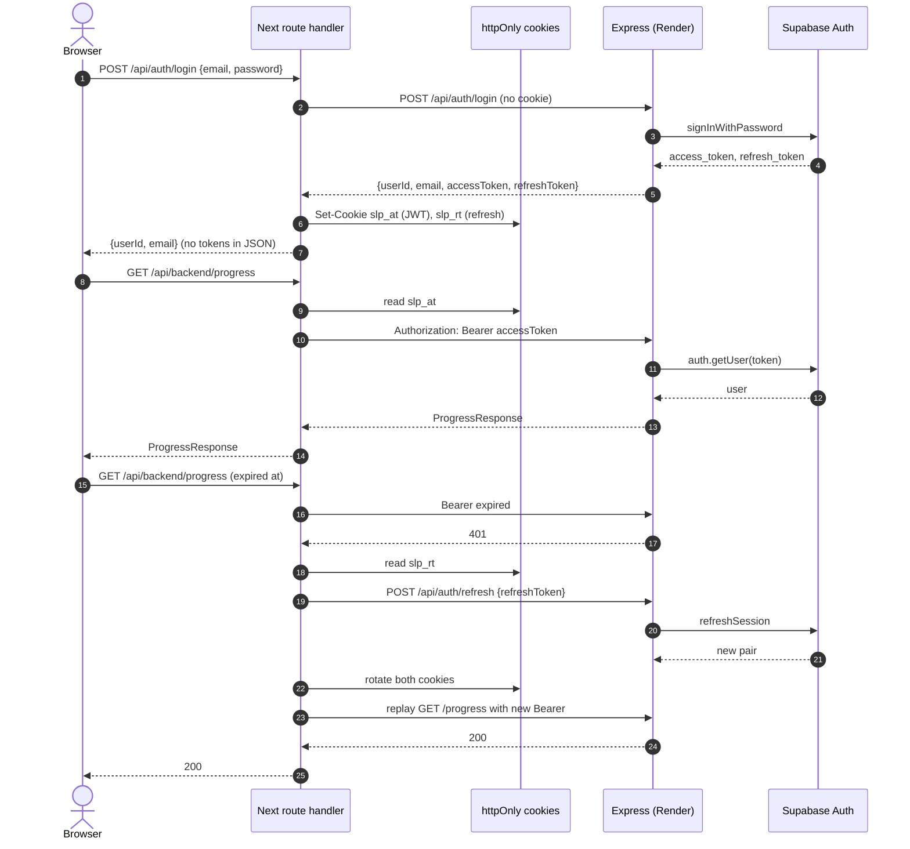
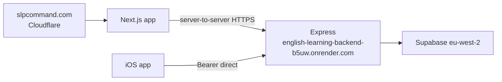
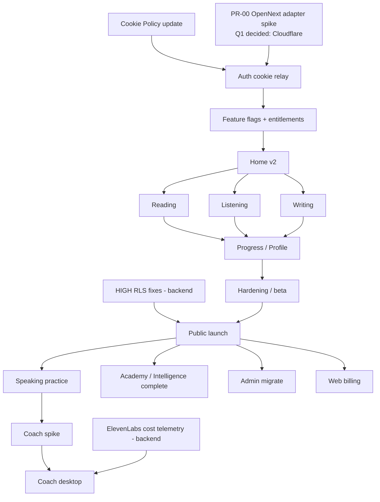

# SLP COMMAND WEB — MASTER PRODUCT & IMPLEMENTATION PLAN

**Date:** 2026-08-16  
**Status:** Approved architecture (Q1 locked). Implementation not started.  
**Q1 decided 2026-08-16: Cloudflare same-origin.**  
**Audience:** Senior engineers who will implement SLPCommand.com as a second client of the existing Express + Supabase system  
**Sources (authoritative, in that order when they conflict):**  
1. `/var/folders/vk/2m1759xs1x113z1cf3x70mk80000gn/T/grok-501/discovery-website.md`  
2. `/var/folders/vk/2m1759xs1x113z1cf3x70mk80000gn/T/grok-501/discovery-ios.md` (iOS SHA `f4ceb8c5`)  
3. `/var/folders/vk/2m1759xs1x113z1cf3x70mk80000gn/T/grok-501/discovery-backend.md` (backend SHA `5ee579aa`)  
4. `/Users/rafael/Desktop/slpcommand-website/docs/SLP-COMMAND-FULL-AUDIT.md` (2026-08-15) — ecosystem context only  

When the audit disagrees with discovery, **discovery wins**. Discrepancies are listed in §B.4.

This document is implementation-grade. Another senior engineer must be able to start building from it without rediscovering the architecture.

---

## Overview

SLP Command is a measurement-first STANAG 6001 / SLP 2–3 English trainer. Production today is three independent deployments of one ecosystem:

| Layer | What it is | Where it lives |
|---|---|---|
| iOS client | SwiftUI MVVM, sole shipped product client | `SLPCommand` `main` @ `f4ceb8c5` |
| Express API | Single authority for auth wrap, entitlements, quotas, proficiency, AI eval | `english-learning-backend` `main` @ `5ee579aa`, `server.js` 16 088 lines, 159 HTTP endpoints, hosted on Render |
| Static web | Marketing + **14** legal/trust/support pages + a **real** `/admin` SPA (not in the public set) | `slpcommand-website` HEAD `f4e53a6`, live at https://slpcommand.com |

The web product is a **second client of the existing backend**, not a rewrite. The backend already allowlists `https://slpcommand.com` and `https://www.slpcommand.com`. Entitlements and progress are explicitly “the client computes nothing.” That is the reason a web client is viable.

What does **not** exist: a learner-facing web app, a web purchase rail, a browser Coach, password reset, email, or any Next.js project. What **must not** be rebuilt: Express, Supabase schema, scoring, quota RPCs, the proficiency engine, legal copy.

---

## Goals & Non-Goals

### Goals

1. Ship a desktop-first learner web app on `slpcommand.com` that speaks the same API iOS already speaks.
2. Absorb the existing static marketing/legal site without breaking extensionless URLs or rewriting load-bearing copy.
3. Authenticate with the existing Express wrappers (`POST /api/auth/login|register|refresh`) via a Next.js httpOnly-cookie relay. Express stays Bearer-JWT only.
4. Render Home v2, Reading / Listening / Writing **practice + exam**, Progress, and Profile as the MVP. Academy and Intelligence are Phase 8 / post-MVP.
5. Migrate the existing `/admin` console; do not invent a new one.
6. Fail closed on entitlements. Never invent `passProbability`. Never derive Estimated SLP on the client.
7. Make quota-consuming calls retry-safe via a server-to-server `X-Idempotency-Key`. Never double-consume.

### Non-Goals (explicit)

- Do **not** rewrite Express as serverless, GraphQL, or a BFF with business logic.
- Do **not** implement billing or Speaking Coach in MVP.
- Do **not** implement password reset / magic link (backend has no email provider; `server.js:1189-1192`).
- Do **not** talk to Render from the browser (except the current admin SPA until it is migrated).
- Do **not** enable CORS `credentials` on Express.
- Do **not** put JWTs in `localStorage`.
- Do **not** show Listening transcripts in practice or exam.
- Do **not** rebuild the five deprecated Writing Intelligence GETs.
- Do **not** use `GET /api/listening/recommendation`, `POST /api/writing/drill-feedback`, `GET /api/reading/next`, `POST /api/reading/exam/start` (v1), `GET /api/progress/save`, or signed-URL Coach.
- Do **not** “fix” the two HIGH RLS views from the web repo. They are backend/Supabase blockers (see §AK).
- Do **not** silently assume Vercel. Production hosting today is Cloudflare-like.
- Do **not** add analytics cookies to public marketing/legal pages without a Cookie Policy rewrite + consent banner.
- Do **not** reimplement `SpeakingTodayPlanner` as a second “what today is for” authority.
- Do **not** ship Academy or Intelligence in MVP (Phase 8).
- Do **not** call `POST /api/learning/onboarding` at launch. That is Home-v3 stateless calibration, not the launch gate. `/onboarding` is a target-level picker (`PATCH /api/profile`) only.

---

## Alternatives Considered

### A1. Browser talks to Render with Bearer in `localStorage` (rejected)

This is what `/admin` does today (`let token = null` in memory; a `localStorage` variant would be worse). CORS already allowlists the apex origin, so it “works” in production for GET/POST/PATCH. It fails for localhost, DELETE, and `X-Idempotency-Key`. XSS can steal the JWT. Cookie Policy would still need an update if anything is persisted. Rejected for the learner app.

### A2. Next.js as a real BFF / new API (rejected)

A GraphQL or tRPC layer that re-implements entitlements, scoring, or session composition would fork the “backend is the only authority” contract and double the surface that must stay in lockstep with iOS. Express already *is* the BFF. Next is a **security relay + HTML renderer**, not a second business layer.

### A3. Next.js same-origin proxy + httpOnly cookies + existing Express (chosen)

Browser never holds the JWT. Next route handlers hold httpOnly cookies and attach `Authorization: Bearer` on the server-to-server hop to Render. CORS does not apply to that hop. Idempotency and DELETE become possible without a backend change. Express stays cookie-free, `credentials: false`. This is the only option that does not force a backend auth-model change and still meets the XSS bar.

A fourth option — Supabase Auth JS in the browser talking to Supabase directly — is **not available**. The backend has no anon-key client; it wraps `signInWithPassword` / `refreshSession` / `getUser` itself. There is no password-reset or magic-link provider. Web must use Express `/api/auth/*`.

---

## Open Questions

These are the only decisions that still need a human. Everything else in this document is a specified default. **Q1 is decided** (Cloudflare same-origin, 2026-08-16); it remains in the table so the fallback condition is visible.

| # | Question | Default if unanswered | Blocks |
|---|---|---|---|
| Q1 | Host the Next app on Cloudflare (OpenNext / same origin) or Vercel (new origin + new subprocessor)? | **DECIDED:** Cloudflare same-origin via OpenNext/Workers adapter. Vercel is fallback only if PR-00 proves the adapter cannot do Set-Cookie / Node timeouts / 15 static routes. | PR-00 is go/no-go for the adapter, not a re-open of the host |
| Q2 | Keep `/admin` on the public origin (noindex) or move to `admin.slpcommand.com`? | Keep `/admin` for MVP; isolate later | Admin PR |
| Q3 | Coach v1 desktop-only, or also attempt Safari iOS? | Desktop-only. Safari iOS is a later decision after the spike | Phase Coach |
| Q4 | Web billing: RevenueCat Web Billing vs Stripe direct? | Not in MVP. Prefer RC Web Billing to reuse `process_billing_webhook_event` if the event map fits | Phase billing |
| Q5 | Who applies the two HIGH RLS view fixes, and when? | Backend owners, before public launch. Web does not touch Supabase | Public launch |
| Q6 | Is a web password-reset in scope later (requires email provider on backend)? | Out of scope until backend grows one | Never invent client-only |
| Q7 | Merge `feat/ux-convergence` iOS test work, or leave archived? | Irrelevant to web; do not block | None |

---

# A. Executive summary

Build SLPCommand.com as a Next.js App Router TypeScript app that **proxies** the existing Render Express API. Reuse ~85–90% of backend logic and 100% of entitlements / proficiency / scoring. Rebuild 100% of the UI. Absorb the current static site and migrate `/admin`.

**MVP** (no Coach, no web billing, no Academy/Intelligence): auth, Home v2 dashboard, Reading + Listening + Writing **practice + exam**, Progress, Profile, legal, entitlements **display**. Realistic effort: **6–8 weeks** for one senior engineer at this quality bar (academy/intelligence moved to Phase 8 so the number describes one slice). The audit’s 2.5–4 week MVP is optimistic: there is no frontend codebase, cookie-relay auth is new, legal copy is load-bearing, and quota safety is a first-class design constraint.

**Full product** adds Academy/Intelligence, Speaking practice/exam, desktop Coach (after a 3–5 day SDK spike), web billing, migrated Admin. **16–22 weeks**. Premium (a11y/SEO/cost telemetry/Safari decision): **22–28 weeks**.

Highest risks: (1) ElevenLabs JS parity for Coach, (2) two HIGH SECURITY DEFINER views, (3) token storage decided wrong, (4) quota double-spend, (5) a mediocre desktop study UX for a paying military audience.

**Do not start Coach or billing in the same train as MVP.** Do not rewrite Express.

---

# B. Current-state assessment

## B.1 Website (`slpcommand-website` @ `f4e53a6`)

Hand-written static marketing + legal site. No `package.json`, no bundler, no README, no favicon, no `robots.txt`, no sitemap, no OG tags. Live at https://slpcommand.com with **extensionless URLs** (`/privacy` ≡ `/privacy.html`). Hosting signal: remote branch `origin/cloudflare/workers-autoconfig`; GitHub Pages is off. Treat production as **Cloudflare Pages-like**. Do not silently assume Vercel.

**15 public HTML pages** at repo root: `index.html` plus **14** legal/trust/support pages (`ai-usage`, `contact`, `cookies`, `data-retention`, `delete-account`, `disclaimer`, `intellectual-property`, `legal-notice`, `privacy`, `security`, `subprocessors`, `support`, `terms`, `trust-center`). `admin/index.html` is **not** at repo root and is **not** in the public/sitemap set. Design system is one file, `style.css` (325 lines), system fonts, `prefers-color-scheme` dark mode, `--accent: #2d5be3`, `--radius: 14px`. `--gold: #c8942a` is declared and unused — optional, not a required brand token.

Legal copy is the product. Dates, quotas, subprocessors, NIF-on-file, Las Palmas jurisdiction, Art. 22 / AI Act Annex III, Apple-not-a-processor, 12-month audit-trail exception, and “dissociated, not fully anonymised” billing language are load-bearing.

Cookie Policy (`cookies.html`, 12 July 2026) claims the **only** storage on slpcommand.com is an in-memory admin session token, therefore **no consent banner**. This claim is already slightly stale (`adminViewMode` is written to `localStorage`) and becomes **legally false** the moment we set httpOnly auth cookies. Cookie Policy update is mandatory before any authenticated cookie is issued. Public marketing/legal pages still must not grow analytics cookies.

**`/admin` is a real production console**, ~1 300 lines, `API = "https://english-learning-backend-b5uw.onrender.com"`, `POST /api/auth/login`, token in a JS variable, `requireAdminUser` (JWT + `user_profiles.is_admin`). It calls 20+ admin endpoints. The audit’s “no existe interfaz de admin” is **stale**. Migrate this console; do not invent another.

Brand register to preserve: “Stop guessing. Start measuring.” Independent, not NATO. AI is indicative, not an official SLP assessment. No pass-probability. Free quotas 10/10 weekly, 3/3/1 monthly, Pro €9.99/month on the landing (Terms refuse to lock a number).

## B.2 iOS (`SLPCommand` @ `f4ceb8c5`)

MVVM + singleton services, 5-tab IA: **Home | Reading | Listening | Speaking | Writing**. Settings is a Home-toolbar sheet; there is **no Profile screen**. Three pure routers: `LaunchRouter` (login → onboarding → home), `DeepLinkRouter` (`slpcommand://…`), `HomeRouter` (server `route` strings only).

`APIClient.swift` (701 lines) is the contract to clone:

- Base URL production: `https://english-learning-backend-b5uw.onrender.com`
- Bearer JWT from Keychain service `slp.auth` (`userId`, `email`, `accessToken`, `refreshToken`)
- Timeouts: 30s/60s default; 120s/180s AI; Speaking evaluate 90s
- 401 → refresh **once** → replay; else logout
- GET-only transient retry (429/502/503/504), 0.4s, same `URLRequest` (same idempotency key)
- POSTs never auto-retry
- `X-Idempotency-Key` on quota calls (see §Quota Safety)
- Typed `APIError` including `.commercial` (402, and 403 with entitlement reasons) and `.writingProcessing`
- camelCase JSON; exception `PATCH /api/profile` `{ "target_level": "2"|"2+"|"3" }`; Speaking multipart fields are snake_case
- Successful evidence POSTs invalidate `SessionTodayService`

Auth: no biometrics, **no password reset**. Register is 5 steps. Logout is aggressive and must be mirrored (clear progress, streak, achievements, entitlements, stores). Session restore checks Keychain `userId+email` only; validation is lazy on first 401.

EntitlementsService / ProgressService: **compute nothing**. Fail-closed. `PlanService.isPro` iff `plan.key == "pro"`.

Home v2 (shipped) reads `session/today` + `progress` + `streak` + `achievements` + `recent` + `entitlements`. Home v3 is behind iOS flag `home_v3_enabled`, **fail-closed**, not a backend-seeded flag. `passProbability` is always treated as null.

PostHog is wired on iOS (`AnalyticsService`). The audit’s “analytics no determinado” is wrong.

## B.3 Backend (`english-learning-backend` @ `5ee579aa`)

Node 18+ Express ESM. Production: `https://english-learning-backend-b5uw.onrender.com`. Two Supabase clients, **both service-role**. No anon-key client. No `cookie-parser`. `requireAuth` is `supabaseAuth.auth.getUser(token)` — live, not a local decode.

CORS (`server.js:347-358`):

```js
origin: [
  'https://english-learning-backend-b5uw.onrender.com',
  'https://slpcommand.com',
  'https://www.slpcommand.com'
]
methods: ['GET', 'POST', 'PATCH']
allowedHeaders: ['Content-Type', 'Authorization']
// credentials unset → cors default false
```

Rate limit: **30 req / 60s / IP** on `/api/*` (`trust proxy = 1`). Billing webhook 300/60, registered first.

`requireQuota` consumes before the handler and **auto-refunds on status ≥ 400**. Clients must not also refund. Missing `X-Idempotency-Key` is accepted (server mints a UUID) but is **not retry-safe**.

No web purchase endpoint. No password-reset endpoint. Coach is conversation-token + webhook, PHASE-4, not signed URL.

## B.4 Discrepancies (audit vs discovery vs peek)

| Claim | Reality | Consequence for web |
|---|---|---|
| Audit: “no admin UI” | `admin/index.html` is a live console | **Migrate**, do not invent |
| Audit: analytics undetermined | iOS PostHog is wired; public site legally has **no** analytics cookies | Two policies, do not conflate |
| Audit: Reading practice = 1 question/encounter | Backend `GET /passage` returns **one** question. iOS view *header* still says “4-question cluster”; view *body* (READING-EXCELLENCE-001) says one question arrives and hides the dots. Peek of `ReadingCloudPracticeView.swift:171-176` + `readingRotation.js` confirms 1. | **Do not invent a 4-question server payload.** Write the UI to accept `questions[]` of length N (defensive) but the live contract is 1. One GET = one `reading_practice` credit. |
| iOS discovery: “Practice is a 4-question cluster” | Overstated; leftover of FASE 10.1B vs later 1-Q rotation | Documented here; discovery loses to the files it cited |
| Audit: Home v2 is “the older stack” of progress + activity | v2 **also** renders `GET /api/session/today` (`TodaySessionCard`) | MVP dashboard **is** Home v2, including today’s mission |
| Audit: Writing Intelligence implemented-functional | iOS removed the 5-feed dashboard; live surface is **Writing Tools** + `POST /api/writing/orchestrator/next` | Do not rebuild deprecated GETs |
| Audit: backend is the only authority for “today” | True for Home v2/v3 + Coach mission + Writing orchestrator. **False** for `SpeakingHomeView` (`SpeakingTodayPlanner` over history) | Web picks backend authority; do not port the planner |
| Audit: 2.5–4 week MVP | Optimistic against this quality bar (no frontend, cookie relay, legal, quota safety) | Plan **6–8 weeks** |
| Audit: deploy frontend on Vercel | Hosting today is Cloudflare-like; Vercel is a **new vendor** (CORS + subprocessors) | **Q1 decided:** Cloudflare same-origin. Vercel only if PR-00 fails |
| Audit: Admin ~25 routes | 31 `requireAdminUser` + 7 `requireAdmin` | Use backend discovery inventory |
| Audit: session restore after token validation | Restore is Keychain userId+email only | Web restore = cookies present; first 401 refreshes |
| `home_v3_enabled` | iOS client default `false`; **not** a seeded backend flag | Do not wait for a backend flag to “turn on” v3 |
| Reading exam paywall key | iOS `ReadingExamView` still uses `.examSimulation` (legacy); backend isolation is `reading_exam_simulation` | Web gates on the **backend** feature key |
| Cookie Policy vs admin | Policy: in-memory only. Admin also writes `localStorage.adminViewMode` | Fix when rewriting Cookie Policy |

---

# C. Architecture decision

**Chosen:** Next.js App Router (TypeScript) on the **same origin** as the marketing site, talking to Render Express **only from the Next server**. Browser → same-origin Next routes → `Authorization: Bearer <Supabase access token>` → Express.



Hosting **decided:** Cloudflare same-origin via OpenNext / `@opennextjs/cloudflare` (or equivalent Workers adapter) so the origin remains `https://slpcommand.com` and CORS/legal do not change. **PR-00** is the go/no-go spike for that adapter (`Set-Cookie`, Node `AbortSignal.timeout`, 15 static routes). Vercel is **fallback only if PR-00 fails**, and then: (a) add the Vercel origin to Express CORS only if any browser-direct call remains, (b) add Vercel to `subprocessors.html`, (c) keep apex marketing on Cloudflare via reverse-proxy or move DNS. Do not silently switch hosts.

Express, Supabase, Render, Sentry on the API, RevenueCat webhooks, ElevenLabs: **unchanged**.

---

# D. Why that architecture

1. Express is already the multi-client authority. iOS and web must see byte-identical business results.
2. CORS `credentials: false` and no `cookie-parser` mean a browser cookie **cannot** be the Express session. A Next relay is the only way to get httpOnly storage without changing the auth model.
3. Server-to-server hops ignore CORS, which unblocks `X-Idempotency-Key` and DELETE **without a backend PR**. That is the safe temporary path and the recommended permanent path.
4. Same-origin Next keeps legal URLs, Cookie Policy scope (`slpcommand.com`), and the existing CORS allowlist.
5. A new BFF would fork entitlements and proficiency — the exact class of bug this codebase has been disciplined about avoiding.
6. Static export alone cannot host the cookie relay or the admin console. Hybrid: static/ISR marketing + legal; dynamic app + admin.

---

# E. Static-site migration strategy



Rules:

| Rule | Detail |
|---|---|
| URL compatibility | App Router routes `/privacy`, `/terms`, … match production. Keep both `/privacy` and `/privacy.html` (redirect `.html` → extensionless, 301). |
| Links | Replace relative `href="privacy"` with root-absolute `/privacy`. Brand mark stays `href="/"`. |
| Copy | **Verbatim** legal text. Do not “tone-edit” Terms, Privacy, Retention, Disclaimer, Legal Notice, AI, Cookies, Subprocessors. |
| Assets | `assets/screenshots/*.png` → `public/assets/screenshots/` so existing paths keep working. |
| SEO vacuum | Add per-page title + description + canonical + OG. Homepage already has a description; the other 14 public pages do not. |
| robots | `Allow: /` ; `Disallow: /admin` ; `Disallow: /dashboard` and all authenticated app routes. Sitemap = **15 public URLs** (`/` + the 14 legal/trust/support pages). If `/pricing` is added as a real route (not only `/#pricing`), sitemap becomes 16. Do **not** include `/admin`. |
| Admin | Stay at `/admin` with `noindex,nofollow`. Do not statically prerender authenticated UI. First ship may keep `admin/index.html` as a public asset; migrate in the Admin PR. |
| Analytics | **No** PostHog/Vercel Analytics/GA on marketing or legal. That is a legal claim, not a TODO. |
| App Store line | Hero “coming to the App Store” already conflicts with Terms/IAP. Do not invent a store URL. Fix copy when the app is actually listed. |
| i18n | Support promises EN+ES for tickets; the site is English-only. Do not invent a Spanish legal set. |

Migration stages: (1) Next serves the same public HTML with the same tokens; (2) authenticated app mounts under `/dashboard`, `/login`, `/reading`, …; (3) admin migrates; (4) retire raw HTML files.

---

# F. Design-system strategy

Source of truth for **web brand** is `style.css`, not iOS `DesignSystem.swift`. iOS uses system indigo + a leaked green AccentColor + skill tints. Web already has a public brand. Do not ship generic Tailwind indigo SaaS.

### Tokens (mandatory)

```css
:root {
  --ink: #0f0f12;
  --ink2: #3a3a42;
  --muted: #6b6b72;
  --accent: #2d5be3;      /* command blue */
  --accent-dark: #1a3fa8;
  --accent-light: #ebeffd;
  --gold: #c8942a;      /* declared in style.css, currently unused — optional */
  --line: #e4e4ea;
  --bg: #ffffff;
  --bg2: #f5f5f9;
  --note-bg: #fff8e6;
  --note-border: #e0c060;
  --radius: 14px;
  --max: 780px;
  --hero-max: 1080px;
}
```

Dark mode **only** via `prefers-color-scheme` (no extra toggle on marketing; Settings may offer system/light/dark like iOS `settings_app_appearance`). Dark overrides as in `style.css`.

### Type

- System stack: `-apple-system, BlinkMacSystemFont, "Segoe UI", Roboto, Helvetica, Arial, sans-serif`
- Body 17px / 1.65 on marketing; app shell 16px / 1.5
- Eyebrow: 13px / 700 / uppercase / `.08em` / accent
- No web fonts. No Inter. No Geist.

### Shape / motion

- Cards 14px. Buttons 12px. Logo mark 8px. Pills 100px.
- Motion 150ms opacity, 100ms translateY. Honour `prefers-reduced-motion` (current site does not; fix it).
- 8px grid inside the app shell (from iOS), not on legal pages.

### Skill accents (app only, secondary to command blue)

| Skill | Accent | Use |
|---|---|---|
| Reading | `#2A6BB8` | skill home, practice chrome |
| Listening | `#1A8CA8` | same |
| Writing | `#219457` | same |
| Speaking / Coach | purple family | same |
| Brand / CTA / focus | `--accent #2d5be3` | always |

### Layout

Desktop-first for study. Persistent left nav (Home, four skills, Progress, Profile) vs iOS tab bar. Marketing keeps the current single-column 1080/780 wrap. Do **not** copy the ≤600px “hide all nav” behaviour — add a real mobile menu.

### Tone

Calm, professional, military-adjacent restraint. One objective, one number, one button on Coach/mission cards. No urgency, no strikethrough prices, no invented “72% likely to pass”. Premium = less chrome, not more.

Implementation: CSS variables in `app/globals.css` + a thin Tailwind config that **maps to those variables** (`accent: var(--accent)`). Do not let Tailwind’s default palette leak into product chrome.

---

# G. Product information architecture

Skill-first, mode-second — matches backend `/api/{skill}/{mode}` and iOS tabs. Do not flatten to `/practice/reading`.

| Route | Auth | Purpose |
|---|---|---|
| `/` | public | Landing (current `index.html`) |
| `/#pricing` plus `/pricing` alias | public | Pricing; keep `#pricing` working |
| `/trust-center` | public | Hub |
| `/privacy` `/terms` `/ai-usage` `/security` `/cookies` `/data-retention` `/delete-account` `/disclaimer` `/intellectual-property` `/legal-notice` `/subprocessors` `/support` `/contact` | public | Legal, extensionless |
| `/login` | public | Email + password. No “forgot password” |
| `/signup` | public | 5-step register matching `RegisterView` + wire enums in §H |
| `/onboarding` | auth, `!onboardingCompleted` | **Target-level picker only** (SLP 2 \| 3 → `PATCH /api/profile`). **Not** `POST /api/learning/onboarding` |
| `/dashboard` | auth | Home v2. Today’s mission + progress + streak + entitlements |
| `/reading` | auth + `reading_enabled` | Skill home (practice + exam entry). Academy/Intelligence links hidden until Phase 8 |
| `/reading/practice` | auth + quota `reading_practice` | One passage, one question |
| `/reading/exam` | auth + `reading_exam_simulation` | `ExamDisclaimerGate` then start-v2 |
| `/reading/academy` `/reading/academy/lesson/[id]` | auth | **Phase 8 / post-MVP.** Server-composed |
| `/reading/intelligence` | auth | **Phase 8 / post-MVP.** 5-feed |
| `/listening` … same practice/exam pattern | auth | No transcripts. Exam play via `/exam/play` |
| `/listening/academy` `/listening/intelligence` | auth | **Phase 8.** Free-set = catalog + prefix rule, not a hand list |
| `/writing` | auth | Practice / exam / history. Tools + academy = Phase 8 |
| `/writing/practice` `/writing/exam` `/writing/history` | auth | Exam local draft OK. History is MVP (needed after submit) |
| `/writing/tools` | auth | **Phase 8.** Transform / examiner / strategy |
| `/speaking` | auth | Skill home. **No** client-side today-planner |
| `/speaking/practice` `/speaking/exam` | auth | Post-MVP |
| `/speaking/coach` | auth + `adaptive_coach` + consent + minutes | Post-MVP, desktop-first |
| `/progress` | auth | Estimated SLP verbatim from `GET /api/progress` |
| `/profile` | auth | Web **does** get a page (iOS hid this in Settings) |
| `/subscription` | auth | Post-MVP paywall. Until then, a read-only plan + “manage in iOS” |
| `/admin` | admin JWT | Migrated console, `noindex` |

Launch gates (clone `LaunchRouter.destination`):

1. No session → `/login`
2. Session, onboarding incomplete → `/onboarding`
3. Else → `/dashboard`

Deep links: support `https://slpcommand.com/reading/practice` etc. Optional `slpcommand://` is iOS-only.

Target level picker: **SLP 2 and SLP 3 only**. Stored `2+` displays as SLP 3. Wire value ∈ `{2, 2+, 3}`.

---

# WEB AUTH / SESSION ARCHITECTURE

Backend is Bearer-JWT only. No cookies. CORS `credentials: false`. **Do not** design browser-cookie → Express.



### Where tokens live

Canonical host is **`slpcommand.com`**. `www.slpcommand.com` **301s** to the apex. Cookies are **host-only** (no `Domain=` attribute). Do not set cookies on both hosts. Prefer `__Host-slp_at` / `__Host-slp_rt` if the host adapter allows the `__Host-` prefix (`Secure` + `Path=/` required for `__Host-`; if we keep `slp_rt` at `Path=/api`, **do not** use `__Host-` on the refresh cookie — use the names below).

| Token | Cookie | Readable by JS? | Path | Flags |
|---|---|---|---|---|
| Supabase **access** token | `slp_at` | **No** | `/` | `HttpOnly; Secure; SameSite=Lax; Max-Age≈3600`; host-only |
| Supabase **refresh** token | `slp_rt` | **No** | **`/api`** (covers `/api/auth/*` **and** `/api/backend/*`) | `HttpOnly; Secure; SameSite=Lax; Max-Age≈14d`; host-only |
| User id / email | React memory + optional non-secret cookie or RSC session payload | Yes | n/a | not a secret |

**`Path=/api` on `slp_rt` is mandatory.** `Path=/api/auth` would make transparent refresh inside `/api/backend/*` impossible — the browser would not attach `slp_rt` to the request that needs it. After `slp_at` expires (~1h), `/api/backend/progress` still carries `slp_rt` and the proxy can rotate.

Never `localStorage`. Never a JS variable for the access token on the learner app (admin today is the exception, retired by the Admin PR).

Cookie names are first-party on `slpcommand.com`. Introducing them **requires** a Cookie Policy update: they are strictly necessary authentication cookies, still no advertising, still no consent banner *if and only if* no analytics cookies are added. Legal, not optional.

### Login

1. Client `POST /api/auth/login` (Next) with `{ email, password }`.
2. Next server `POST ${BACKEND_URL}/api/auth/login` with the same JSON. No cookies on that hop. Never forward the browser `Cookie` header.
3. Express → `signInWithPassword` → `{ userId, email, accessToken, refreshToken }` (failed login is **400**, not 401, `{ error: <supabase message> }`).
4. Next sets `slp_at` / `slp_rt`. Response body to the browser is `{ userId, email }` only.
5. Client fetch `GET /api/entitlements` + `GET /api/profile` via the proxy. **Entitlements 404 is not a login failure** (see below). Only a 401 after refresh-fail logs the user out.
6. User-facing login errors (mirror iOS `LoginView`):
   - Network / timeout / 5xx / cannot reach Next or Render → **“Unable to connect. Check your connection and try again.”**
   - Anything else (including Express 400 with a Supabase message) → **“Incorrect email or password.”**
   - Log the raw body server-side. Never render the Supabase string.

Register is the same pattern against `POST /api/auth/register`. If Supabase requires email confirmation, `accessToken` is null — show an honest “check your email” state; do not invent a mailer.

**Register wire enums** (`AuthModels.swift` — send the **raw** values, camelCase field names):

| Field | Wire values |
|---|---|
| `professionRole` | `military` \| `civilian` \| `student` \| `other` |
| `englishLevel` | `A1` \| `A2` \| `B1` \| `B2` \| `C1` \| `C2` |
| `learningGoal` | `stanag_exam` \| `military_proficiency` \| `casual_learning` \| `advanced_mode` |
| `goalDeadline` | `this_month` \| `three_months` \| `six_months` \| `flexible` |

Body: `{ email, password, firstName, lastName, country, professionRole, englishLevel?, learningGoal?, goalDeadline? }`.

**Entitlements after login.** `GET /api/entitlements` returns **404** `{ error: "No active plan found for this account." }` when `user_plans` has no active row (`server.js:14448-14451`) — including the new-user race before `assign_free_plan_to_new_user`. Treat 404 no-plan and 5xx the same as a missing snapshot: **no Pro chrome, disable quota CTAs, do not cache a grant, do not clear the session.** Optionally retry once after ~400 ms. Only 401 after refresh-fail is a logout.

### Refresh

- Endpoint: Express `POST /api/auth/refresh` `{ refreshToken }` → `{ accessToken, refreshToken }` or 401 `{ error: "Invalid or expired refresh token" }`. A successful refresh **rotates** `refreshToken` (`server.js:1251-1254`).
- Next `POST /api/auth/refresh` reads `slp_rt`, calls Express, rotates both cookies.
- **Default refresh owner is the browser** (option b below). The catch-all does **not** silently refresh-and-clear across isolates.
- **Proactive refresh (same isolate / RSC only):** if `slp_at` is missing but `slp_rt` is present **on this request**, `backendFetch` may refresh **before** the upstream call. Vitest: request to `/api/backend/progress` with only `slp_rt` still rotates cookies and returns the payload.

### Single-flight refresh (mandatory) — option (b) is the MVP rule

Dashboard first paint is five parallel calls. Each 401 independently “refresh once” would present a just-rotated `refreshToken` four more times → 401 → logout. Serverless/edge replicas make an in-memory mutex insufficient across isolates. **`cookies()` reads this request’s inbound cookies, not a sibling isolate’s `Set-Cookie`.** Ban “re-read cookies() after a sibling refresh” as a mitigation — it cannot see the winner’s new pair.

**MVP rule (option b — no new infra):** client-side single-flight.

1. Browser `lib/api/client.ts` holds one in-flight `POST /api/auth/refresh` promise per tab.
2. On **401** from `/api/backend/*`, the client calls `POST /api/auth/refresh` **once** and retries the original request (same method/path/body/idempotency key). Parallel 401s await that one promise.
3. The catch-all / `backendFetch` **must not** `Set-Cookie` `Max-Age=0` on a refresh 401 unless it can **prove** this request’s inbound `slp_rt` is still the cookie it would clear: compare `SHA-256(inbound slp_rt)` to `SHA-256(slp_rt already on the outgoing Set-Cookie jar for this response)`. If they differ, or if the hash is unknown, **leave cookies untouched** and return 401 `{ error: "unauthorized" }` so the client can coalesce. A losing isolate must **not** delete the winner’s cookies.
4. Same-isolate RSC first-paint (five `backendFetch` in one isolate) may still share one in-memory promise keyed by `SHA-256(slp_rt)`. That does **not** extend across isolates.
5. **Do not** implement Cloudflare KV / Durable Object for MVP. Mentioned only as later hardening if client-coalesce plus the no-clobber rule is ever insufficient.

**Tests:**

- Same-isolate: five parallel `/api/backend/*` with an expired `slp_at` produce **one** Express `/api/auth/refresh` and five 200s.
- Losing-isolate: isolate A rotates cookies; isolate B’s refresh 401s on the spent `slp_rt`. B’s response **must not** contain `Set-Cookie` Max-Age=0 for `slp_at` / `slp_rt`. The winner’s pair survives.
- Client-coalesce: two simultaneous 401s from `lib/api/client.ts` produce one `POST /api/auth/refresh`.

### Logout

`POST /api/auth/logout` (Next only — Express has no logout):

1. Clear `slp_at` and `slp_rt` (`Set-Cookie` Max-Age=0, same Path/host-only as set).
2. Client mirrors iOS `AuthManager.logout` **and** `SettingsManager.userDataKeys` (see §R). Do **not** clear `session_preferred_minutes` (iOS does not). Do clear `onboarding_completed`, weekly goal, exam date, writing exam draft keyed by userId, React Query, entitlements/progress/streak/achievements stores. Route to `/login`.
3. Do **not** call RevenueCat (no web SDK in MVP).

Account delete: Next `DELETE /api/backend/account` → Express `DELETE /api/account` (server-to-server; CORS DELETE does not apply). Then logout. Failure copy: contact `support@slpcommand.com`.

### 401 retry (mirror `APIClient`)

Two layers. The **browser** is the cross-request coalescer. The **proxy** may refresh once **inside this request** (same isolate) but must not clobber a sibling’s cookies.

**Catch-all / `backendFetch` (this request only):**

1. If `slp_at` is present, forward to Express with it.
2. If `slp_at` is missing and `slp_rt` is present on **this** request, proactive-refresh first (same-isolate promise).
3. If Express returns 401 and this isolate has not yet refreshed, try one same-isolate refresh.
4. If refresh succeeds, rotate cookies on **this** response, replay **the same** method/path/body/**client-supplied** idempotency key.
5. If refresh returns 401: **do not** `Max-Age=0` unless the inbound `slp_rt` hash still matches the cookie this response would clear (see single-flight rule 3). Otherwise return 401 `{ error: "unauthorized" }` with cookies **untouched**.
6. Never refresh-loop. Never replay a request that already had its refresh attempt.

**Browser (`lib/api/client.ts`):**

1. On 401 from `/api/backend/*`, single-flight `POST /api/auth/refresh`.
2. If refresh 200, retry the original `/api/backend/*` once (same idempotency key).
3. If refresh 401 (and cookies were actually cleared, or a second try still 401s), route to `/login`.

### Server-side API calls (RSC / route handlers / server actions)

**One function is the only outbound path to Express:** `lib/server/backend.ts#backendFetch`, which **must** call `lib/server/proxyPolicy.ts` (allowlist, 410 deny, method check, outbound header constructor). The catch-all route **and** every RSC / server action call this function. There is no second hop.

- RSC **never** HTTP-loops to `/api/backend/*` on itself (no `fetch("https://slpcommand.com/api/backend/...")` from a server component).
- **eslint:** `no-restricted-imports` / a custom `no-restricted-syntax` that forbids `fetch(BACKEND_URL)` and `fetch(process.env.BACKEND_URL + …)` **outside** `lib/server/backend.ts`. CI fails the PR.
- Reads `slp_at` / `slp_rt` from `next/headers` cookies.
- Builds the **outbound** header set from the allowlist. **Never** copies `incoming.headers`. **Never** forwards `Cookie`.
- Injects `Authorization: Bearer <slp_at>` from the cookie, never from a browser `Authorization`.
- Forwards `X-Idempotency-Key` if the caller supplied one; never replaces it. Missing key on a quota path → 400 (same as the catch-all).
- Attaches `x-correlation-id` (generate if absent).
- Sets a **computed** client-IP header (see IP hop — **UNVERIFIED**).
- Same-isolate 401 refresh only; no-clobber rule on refresh 401 (see Single-flight).
- Never serializes tokens into the RSC payload.

`X-SLP-Client` is **catch-all-only** (browser hop). RSC → `backendFetch` is already server-side; CSRF N/A. The catch-all rejects a browser request without the header **before** calling `backendFetch`.

### Client-side interactive calls

All browser `fetch` goes to **same-origin** `/api/backend/*` (or dedicated `/api/auth/*`). The browser client (`lib/api/client.ts`):

- Does **not** know the Render host.
- Does **not** attach `Authorization`.
- **Does** attach `X-SLP-Client: web` on every `/api/backend/*` call (CSRF).
- **Does** attach `X-Idempotency-Key` on quota-consuming calls (same-origin; CORS does not apply). Next **forwards** this header and **never replaces** a client-supplied key.
- Accepts `AbortSignal` and client-side timeouts; the **upstream** Render hop also has `AbortSignal.timeout` per the timeout table.

**Documented exception:** none for the learner app.  
**Temporary exception:** today’s `/admin` SPA talks to Render directly with an in-memory Bearer. Retire this in the Admin PR. Until then, localhost admin is CORS-blocked (see CORS section).

### CSRF once cookies exist

Express is not the cookie consumer, so Express CSRF is N/A. Next **is**.

**Quota-consuming GETs are state-changing.** `GET /api/reading/passage` and `GET /api/listening/slp/next` run `requireQuota` before the handler. A cross-site top-level GET to `https://slpcommand.com/api/backend/reading/passage` **will** send `slp_at` (`Path=/`, `SameSite=Lax`) and debit a credit. Prefetchers and `<a href>` from email/chat have the same shape. **Do not call Lax GET “acceptable / no state change.”** iOS is not exposed because it does not use cookies.

| Control | Required |
|---|---|
| `SameSite=Lax` | Yes. Necessary but **not sufficient** for quota GETs. |
| `Secure` | Yes (HTTPS only). Localhost HTTP is exempt in browsers. |
| `X-SLP-Client: web` on **every** `/api/backend/*` | **Yes.** Next returns **400** `{ error: "missing_client_header" }` without it. Top-level navigations, prefetch, and `<a href>` cannot set it, so they never reach Render. Vitest/Playwright: a cookie-only GET to the proxy does **not** produce an outbound Render request. |
| Origin check on mutating Next routes | Yes, additionally, on POST/PATCH/DELETE. Allow the canonical origin + local origin in development. Reject missing/mismatched `Origin`. |
| Double-submit CSRF | Not required for MVP given the custom header. Revisit if we ever drop `X-SLP-Client`. |
| CORS on Next | Browser only calls same origin. |

`X-SLP-Client` is a non-simple header: a cross-origin XHR would preflight. Same-origin `fetch` from our JS sets it. **Only the catch-all** (`/api/backend/*`) requires it. RSC calls `backendFetch` directly and does **not** send `X-SLP-Client`. Do **not** put this header check in global middleware.

### `middleware.ts` matchers (split — do not combine)

Next middleware runs on document GETs. Top-level navigations cannot set `X-SLP-Client`. One global matcher would 400 `/dashboard`. **Three separate concerns, three matchers:**

| File / matcher | Runs on | Does | Must not |
|---|---|---|---|
| `middleware.ts` matcher `"/api/backend/:path*"` | `/api/backend/*` only | Require `X-SLP-Client: web` → else 400 `missing_client_header`, no upstream. May also be implemented inside the catch-all route instead of middleware; either is fine **if** the matcher is this narrow. | Run on `/dashboard`, `/reading/*`, `/privacy`, `/api/auth/*` |
| `middleware.ts` matcher `"/api/:path*"` | `/api/*` | Origin check on **mutating** methods (POST/PATCH/DELETE). Allow canonical + local origin. Reject missing/mismatched `Origin`. GET is not origin-checked here (the CSRF header covers quota GETs on `/api/backend/*`). | Require `X-SLP-Client`. Redirect unauthenticated users. |
| Page-level (not middleware), e.g. `app/(app)/layout.tsx` | `/dashboard`, `/reading/*`, `/listening/*`, `/writing/*`, `/progress`, `/profile`, `/onboarding` | Launch gates: no session → `/login`; session but `!onboardingCompleted` → `/onboarding`. | Run on `/api/*`. Require `X-SLP-Client`. |

Suggested config (do not merge into one `matcher: "/:path*"`):

```ts
// middleware.ts — export ONE function that branches on the path.
// Matcher A (narrow):
export const config = {
  matcher: [
    "/api/backend/:path*",   // CSRF header
    "/api/:path*",           // Origin on mutating (branch: if method is GET, no-op unless path is /api/backend)
  ],
};
// Launch gates live in app/(app)/layout.tsx, NOT here.
```

`/api/auth/*` is Origin-checked on POST (login/register/refresh/logout) and does **not** require `X-SLP-Client`.

### Session expiration

- Access JWT expiry (~1h): if `slp_rt` is present, **invisible** (proactive or 401 refresh). If `slp_rt` is absent, 401 → login.
- Refresh expiry or revoked session: proxy returns 401; client logout; `/login`.
- Idle: no extra idle timer in MVP (iOS has none).
- Multi-tab: cookies are shared; a logout in one tab must broadcast (`storage` event on a tiny non-secret `slp_session_epoch` key, or `BroadcastChannel`) so other tabs dump memory state.

### What we are not doing

- No `supabase-js` in the browser.
- **No `Cookie` header on any request to Express.** Outbound allowlist only (see API CONTRACT).
- No `credentials: 'include'` to Render.
- No browser `Authorization` forwarded (only the cookie-derived Bearer).
- No debug `userId` query fallback (backend fail-closed unless `NODE_ENV !== production` **and** `ALLOW_DEBUG_AUTH_FALLBACK=true`).

---

# CORS / LOCAL DEVELOPMENT

### Current exact config (`server.js:347-358`)

| Axis | Value |
|---|---|
| Origins | `https://english-learning-backend-b5uw.onrender.com`, `https://slpcommand.com`, `https://www.slpcommand.com` |
| Methods | `GET`, `POST`, `PATCH` |
| Headers | `Content-Type`, `Authorization` |
| Credentials | unset → **false** |

### Classification

| Gap | If browser → Render | If Next server → Render | Verdict |
|---|---|---|---|
| No `localhost` / `127.0.0.1` | Preflight fail. Local admin and any direct fetch die. | CORS does not apply. | **BLOCKER FOR DEVELOPMENT** only if any browser-direct call remains (today: admin). **NOT A BLOCKER** for the learner app **if** all browser calls go through Next. |
| No preview origins (Vercel/CF `*.pages.dev` / `*.vercel.app`) | Preview admin/login-direct dies. | CORS does not apply. | **BLOCKER FOR DEVELOPMENT** of preview **direct** calls. **NOT REQUIRED** if previews use same-origin proxy. |
| `DELETE` not allowed | `DELETE /api/account`, `DELETE /api/speaking/attempts/:id/audio` fail preflight. | CORS does not apply; Next can DELETE. | **NOT REQUIRED** for MVP if proxy is used. **BLOCKER FOR PRODUCTION** of browser-direct account deletion. Account deletion **is** required for GDPR before public launch — via the proxy, not via a CORS change. |
| `X-Idempotency-Key` not allowed | Every quota call that sends it fails preflight. | Next **may** attach the header. | **BLOCKER FOR PRODUCTION** of browser-direct quota calls. **NOT A BLOCKER** (and recommended permanent path) if Next attaches it. **BLOCKER FOR MVP** if anyone tries to fetch Render from a client component. |
| `X-Admin-Secret` not allowed | Legacy content-gen cannot be called from JS. | Not needed; those routes stay operator-only. | **NOT REQUIRED** |
| `credentials: false` | Browser cookies would not be sent to Render even if we set them. | Irrelevant. | **Do not enable credentials** unless the auth model changes (it must not). |

**State this clearly:** if the Next.js server-side proxy talks server-to-server to Render, **CORS does not apply to that hop**. Localhost is then **not** a CORS blocker **iff** all browser calls go through Next. Direct-from-browser-to-Render (today’s admin) **is** blocked on localhost.

### Backend CORS change request (not a patch; do not modify the backend from this repo)

Ask backend owners, only if any browser-direct call must remain:

```
1. allowedHeaders: add 'X-Idempotency-Key' (and 'x-correlation-id' if we ever send it from a browser).
2. methods: add 'DELETE' iff account deletion or speaking-audio deletion must run as browser→Render.
3. origin: add http://localhost:3000 and specific preview origins iff any browser-direct call remains.
4. Do NOT set credentials: true.
5. Do NOT add a wildcard origin.
```

Recommended: **make no CORS change**. Force every browser call through Next. Then the allowlist can stay exactly as it is.

### Client-IP / rate-limit hop — UNVERIFIED (open launch risk)

Do **not** treat `X-Forwarded-For` forwarding as solved.

Hop count: Browser → Next/Cloudflare → **Render** → Express. `app.set("trust proxy", 1)` (`server.js:346`) trusts **one** proxy (Render). If Render appends the connecting IP (Next egress), `req.ip` is Next, not the browser — every user shares one 30/60 bucket. If Next blindly forwards a client-supplied `X-Forwarded-For`, clients can spoof limiter keys.

This was **not measured** against live Render. Until it is:

1. Next **computes** the browser IP from `CF-Connecting-IP` (Cloudflare) or the platform socket; **never** from a browser-supplied `X-Forwarded-For` / `X-Real-IP`.
2. Next **may** send that value as `X-SLP-Client-IP` on the outbound allowlist. Express **ignores** it today.
3. **Backend follow-up (not a web patch):** either `trust proxy = 2` after measuring the hop list, **or** teach `apiLimiter` to prefer `X-SLP-Client-IP` when present **and** the request comes from the Next egress CIDR. Do not guess.
4. Until that lands, **shared-egress 30/60 is an open public-launch risk** (KD5, AF #5, AK). Dashboard budget (≤5 + 0 echo + 2 lazy) reduces blast radius; it does not fix a shared bucket.

---

# API CONTRACT STRATEGY

One web API client. **No ad-hoc `fetch` in React components.**

```
lib/api/types.ts          // DTOs; prefer backend wire names (progress confidence_* is snake)
lib/api/errors.ts         // typed FrontendError
lib/api/client.ts         // browser: same-origin /api/backend/*
lib/server/backend.ts     // server: Render + cookies + refresh + allowlist
lib/server/authCookies.ts // cookie options, set/clear/rotate
lib/server/proxyPolicy.ts // allowlist + deny + rewrite
app/api/auth/login/route.ts
app/api/auth/register/route.ts
app/api/auth/refresh/route.ts
app/api/auth/logout/route.ts
app/api/backend/[...path]/route.ts
```

### Catch-all rewrite

`app/api/backend/[...path]/route.ts` is the **only browser hop**. It does not fetch Express itself — it calls `backendFetch`. `backendFetch` is the **only outbound path** to Render (RSC uses it too).

```
const path = params.path.join("/")           // e.g. ["progress"] or ["reading","passage"]
const upstream = `${BACKEND_URL}/api/${path}${search}`
// GET /api/backend/progress          → GET ${BACKEND_URL}/api/progress
// GET /api/backend/reading/passage   → GET ${BACKEND_URL}/api/reading/passage
// DELETE /api/backend/account        → DELETE ${BACKEND_URL}/api/account
```

| Rule | Value |
|---|---|
| Methods | **GET, POST, PATCH, DELETE only.** Anything else (PUT, OPTIONS as a handler, etc.) → **404** from Next, no upstream. |
| Query string | Forward `search` verbatim (`?minutes=25&timezone=…`). |
| Multipart | **Not** on the catch-all. Speaking evaluate/save-audio use a dedicated route (post-MVP) that streams the body. Catch-all is JSON only. |
| Timeouts | Enforced on the **Render hop** via `AbortSignal.timeout`: 30s default; 120s Writing submit / sentence-feedback / transform; 90s Speaking evaluate. Client may abort earlier. |
| Unknown / denied path | See LEGACY ENDPOINT POLICY. Catch-all is **not** a denylist-only hole. |

### Outbound header allowlist (Express never sees cookies)

A naïve `fetch(BACKEND + path, { headers: incoming.headers })` would send `Cookie: slp_at=…; slp_rt=…` to Render. **Forbidden.**

Build a **new** `Headers` object. Allow **only**:

| Header | Source |
|---|---|
| `Authorization` | `Bearer ${slp_at}` from the httpOnly cookie. **Never** from a browser `Authorization`. |
| `Content-Type` | From the incoming body type (`application/json`, or the dedicated speaking multipart route). |
| `X-Idempotency-Key` | From the incoming request **if present**. Never minted as a replacement for a client key. |
| `x-correlation-id` | Incoming or newly generated UUID. Echo on the response. |
| `X-SLP-Client-IP` | Computed from `CF-Connecting-IP` / socket. **Never** from browser `X-Forwarded-For`. Express ignores it until the backend follow-up. |
| `Accept` | `application/json` |

**Drop everything else**, including: `Cookie`, `cookie`, `slp_*`, browser `Authorization`, `X-Forwarded-For` (do not blindly copy), `X-Admin-Secret`, `X-SLP-Client` (Next-only CSRF; Express does not know it).

Unit test: the upstream request has **no** `Cookie` header and no browser-supplied `Authorization`.

### Centralize

| Concern | Rule |
|---|---|
| Base URL | Browser: `''` (same origin) + `/api/backend`. Server: `process.env.BACKEND_URL` default `https://english-learning-backend-b5uw.onrender.com`. **Never** hardcode Render in a client component. |
| Authorization | Server injects `Authorization: Bearer` from `slp_at`. Browser never sees it. |
| JSON | camelCase as iOS, **except:** `PATCH /api/profile` body `{ target_level }`; Speaking multipart snake fields; **progress confidence trio is snake on the wire** (`confidence_label` / `confidence_scale` / `confidence_explanation`) — decode both casings, prefer backend names in types. |
| Refresh | Single-flight, keyed by hashed `slp_rt`. Proactive if `slp_at` missing. |
| 401 retry | Proxy, once, then replay with the **same** idempotency key. |
| Correlation ID | Generate UUID per browser request; send `x-correlation-id`. Echo back. Surface on unexpected-error UI. |
| Idempotency | Client **sends** `X-Idempotency-Key` same-origin; Next **forwards, never replaces**. See Quota Safety. |
| Error normalization | See the dedicated section below. Never render raw `error` / `reason`. |
| 402 / 403 commercial | → `CommercialError`. Paywall or quota-exhausted UI. |
| Cancellation | Every hook accepts `AbortSignal`. Unmount aborts. |
| Timeout | 30s / 120s / 90s as above, on the Render hop. |
| Telemetry | Sentry (app, scrub bodies/headers). **No** PostHog on web until Cookie Policy distinguishes authenticated-app cookies. |
| Rate-limit hygiene | Dashboard ≤5 SSR + 0 hydrate echo + 2 lazy. IP hop **UNVERIFIED**. No polling < 2s. |

---

# ERROR NORMALIZATION

There is **no** global Express envelope. The proxy and `lib/api/errors.ts` map `status × domain` → a typed `FrontendError`. The browser **never** renders raw `error` or `reason` strings. Unexpected errors always show `x-correlation-id`. Keep the raw body in server/Sentry logs only.

### `FrontendError` types

`network` | `auth` | `quota` (402) | `entitlement` (403 commercial) | `validation` | `backend` | `aiProcessing` (`WritingErrorReason`) | `audio` | `rateLimit` | `noPlan` | `unexpected`

Clone iOS `APIClient.performOnce` + `discovery-backend.md` §14:

| HTTP | Domain / body | `FrontendError` | User copy (EN) | Session? |
|---|---|---|---|---|
| network / timeout / abort | — | `network` | “Unable to connect. Check your connection and try again.” | keep |
| 400 | `POST /api/auth/login` or `/register` | `auth` (credentials) | “Incorrect email or password.” (register: map validation separately if the body is missing-fields, else generic) | n/a |
| 400 | Writing `reason: invalid_submission` | `aiProcessing` | Writing map below | keep |
| 400 | `invalid_idempotency_key` | `validation` | “Something went wrong. Try again.” (do not mention the key) | keep |
| 400 | other | `validation` | “That request was not valid.” | keep |
| 401 | after refresh-fail | `auth` | “Please sign in again.” | **logout** |
| 401 | `Invalid or expired refresh token` | `auth` | same | **logout** |
| 402 | `{ reason, remaining, limit, period }` commercial | `quota` | feature-specific quota card (never the raw sentence if we have a better one; never the JSON) | keep |
| 403 | `reason` ∈ `{no_active_plan, feature_not_in_plan, unknown_feature, no_quota_definition}` | `entitlement` | paywall / “not on your plan” | keep |
| 403 | `Admin access required` | `entitlement` | “This account is not an administrator.” | keep (admin) |
| 403 | other (`Forbidden`, Coach `consent_required`) | `entitlement` / Coach map | typed copy | keep |
| 404 | `GET /api/entitlements` `"No active plan found for this account."` | **`noPlan`** | no Pro chrome; disable quota CTAs | **keep** (not login failure) |
| 404 | `GET /api/listening/slp/next` `"No hay listenings activos disponibles"` | `backend` | “No listening items available right now.” | keep |
| 404 | exam `"Exam session not found"` | `backend` | “This exam session is no longer available.” | keep |
| 404 | writing `prompt_unavailable` | `aiProcessing` | Writing map | keep |
| 404 | other | `backend` | “We couldn’t find that.” | keep |
| 409 | Coach `session_already_open` | Coach `sessionAlreadyOpen` | “You already have a coach session open.” | keep |
| 409 | listening exam closed/expired | `backend` | “This exam has already been submitted.” | keep |
| 413 | speaking too large | `audio` | “That recording is too large (10 MB max).” | keep |
| 422 | speaking `notEvaluable` / `tooShort` | `audio` | “We couldn’t evaluate that recording.” / “Recording is too short.” | keep |
| 429 | body `reason: daily_limit_reached` (writing 20/day) | `rateLimit` (business) | “Daily technical limit (20 evaluations). This is not your plan quota.” | keep |
| 429 | speaking technical 10/day | `rateLimit` (business) | “Daily technical limit (10 evaluations). This is not your plan quota.” | keep |
| 429 | express-rate-limit `{ message: "Too many requests, please try again later." }` | `rateLimit` (IP) | “Too many requests. Wait a minute and try again.” | keep |
| 500–504 | Writing `sendWritingError` envelope | `aiProcessing` | Writing map; honour `retryable` | keep |
| 503 | Coach `coach_disabled` | `coachUnavailable` | “Coach is turned off right now.” | keep |
| 503 | Coach `coach_unavailable` | `providerUnavailable` | “The voice service is unavailable.” | keep |
| 503 | learning `evidence_unavailable` | `backend` | “Learning data is temporarily unavailable.” | keep |
| 5xx | other | `backend` | “Something went wrong. Reference {correlationId}.” | keep |
| decode fail | 2xx unparsable | `unexpected` | same + correlation id | keep |

**WritingErrorReason** → user copy (never IDs):

| `reason` | Copy |
|---|---|
| `prompt_unavailable` | “No writing prompt is available right now.” |
| `ai_timeout` | “The evaluator timed out. You were not charged. Try again.” |
| `ai_upstream_error` | “The evaluator is unavailable. You were not charged.” |
| `ai_parse_failed` | “We couldn’t read the evaluation. You were not charged.” |
| `database_read_failed` / `database_write_failed` | “We couldn’t save that just now. You were not charged.” |
| `service_unavailable` | “Writing evaluation is temporarily unavailable.” |
| `invalid_submission` | “That text couldn’t be submitted. Check the length and try again.” |
| `unknown_processing_error` | “Something went wrong evaluating that text. Reference {correlationId}.” |

Writing envelope: `{ error: "writing_processing_failed", reason, request_id, retryable }`. Statuses: 400 invalid, 502 upstream/parse, 504 timeout, 503 DB, 500 unknown. Commercial 402/403 are **not** rewritten (middleware first).

Coach start: `{ error: "<reason>" }` with 402/403/409/503 — use the Coach map in §N, never the entitlements sentence.

### Proxy remapping

The catch-all **does not** rewrite status codes. It forwards the Express status and JSON. `lib/api/client.ts` / `errors.ts` performs the map. RSC uses the same mapper. Never `JSON.error` into a `<p>`.

---

# LEGACY ENDPOINT POLICY

The catch-all **must not** be denylist-only. A denylist misses `GET /api/reading/next`, `POST /api/writing/drill-feedback`, future webhooks, and it **removes** the CORS protection that currently blocks `X-Admin-Secret` generate routes from browsers.

### Enforcement order

Lives in `lib/server/proxyPolicy.ts`, invoked by **`backendFetch` only**. The catch-all adds step 2 (CSRF) **before** calling `backendFetch`. RSC skips step 2.

1. Method ∈ {GET, POST, PATCH, DELETE} else **404**.
2. **Catch-all only:** `X-SLP-Client: web` present else **400** `missing_client_header` (no `backendFetch`).
3. Path matches the **hard deny** list → **410** `{ error: "gone", reason: "<legacy_or_internal>" }` (no upstream). Use 410 so a mistaken client call is visible in telemetry; do not silently 404 internals (that hides bugs). Webhooks and generate routes are 410, not proxied.
4. Path matches the **learner allowlist** (prefix) → rewrite and forward via `backendFetch`.
5. Else → **404** from Next (no upstream).

Admin-user routes stay **off** the learner allowlist until the Admin PR (**PR-16**), which uses a separate `/api/admin-backend/[...path]` (or the same catch-all with an extra `is_admin` gate). Shared-secret routes are never allowlisted.

### Hard deny (410, no upstream)

| Path | Why |
|---|---|
| `POST /api/billing/revenuecat/webhook` | Provider → Express only |
| `POST /api/speaking/coach/webhook` | HMAC raw body; never a browser |
| `POST /api/admin/billing/reconcile` | `requireAdmin` secret |
| `GET /api/internal/*` | `requireAdmin` secret |
| `POST /api/reading/generate` | `requireAdmin` secret |
| `POST /api/listening/generate` | `requireAdmin` secret |
| `POST /api/writing/prompts/generate-batch` | `requireAdmin` secret |
| `GET /api/listening/telemetry/metrics` | `requireAdmin` secret |
| `GET /api/reading/next` | legacy practice; `/passage` replaced it |
| `POST /api/reading/exam/start` | legacy v1 exam; use `start-v2` |
| `POST /api/writing/drill-feedback` | deprecated; log-warns; no client |
| `GET /api/listening/recommendation` | dead; may 204; nothing calls it |
| `POST /api/progress/save` | legacy listening write |
| any signed-URL Coach start | PHASE-4 obsolete |

### Learner allowlist (prefix; MVP)

```
/api/auth/login          (dedicated route, not catch-all)
/api/auth/register
/api/auth/refresh
GET  /api/feature-flags
GET  /api/entitlements
GET  /api/progress
GET  /api/profile
PATCH /api/profile
GET  /api/account/export
DELETE /api/account
POST /api/reports
GET  /api/session/today
GET  /api/activity/streak
GET  /api/activity/achievements
GET  /api/activity/recent
GET  /api/reading/passage
POST /api/reading/answer
POST /api/reading/exam/start-v2
POST /api/reading/exam/finish
GET  /api/listening/slp/next
POST /api/listening/slp/answer
POST /api/listening/slp/exam/start
POST /api/listening/slp/exam/answer
POST /api/listening/slp/exam/play
GET  /api/listening/slp/exam/state
POST /api/listening/slp/exam/finish
GET  /api/writing/prompts/next
POST /api/writing/submit
GET  /api/writing/attempts
```

Phase 8+ adds academy/intelligence/orchestrator/transform prefixes. Phase 7 adds `/api/speaking/*` except the webhook. Phase 9 adds `/api/admin/*` **user** routes only, on the admin catch-all. Home v3 adds `/api/learning/*` except it is not MVP.

### Why the six product-legacy paths are denied

- `/api/reading/next` — same quota as `/passage`, older shape, no `correctIndex`. Live iOS practice does not call it.
- `/api/reading/exam/start` — unmarked deprecated; no persisted form; may generate questions on the fly; live view is `start-v2`.
- `/api/writing/drill-feedback` — explicit DEPRECATED log; consumes `writing_ai_feedback`.
- Writing intelligence GETs (readiness/missions/brain-profile/mastery) — contradict v3; iOS dashboard removed them. **Deny** if someone adds them later; they are not on the allowlist.
- `/api/listening/recommendation` — dead; orchestrator comment: nothing called it.
- `/api/progress/save` — legacy listening write.
- Signed-URL Coach — PHASE-4 obsolete; token only.

---

# QUOTA SAFETY

Backend `requireQuota` consumes **before** the handler and auto-refunds on `status >= 400` (`entitlements.js:320-327`). **The client must never also refund.**

CORS blocks `X-Idempotency-Key` only on **browser → Render**. Same-origin browser → Next **may** send it. **All quota-consuming calls go through Next.** Next forwards the client key to Express. This is the safe temporary path and the recommended permanent path.

**Do not retry POSTs/GETs that consume quota from the browser without an idempotency key.** Never implement a retry that could double-consume.

| Operation | Endpoint | Quota key | Who generates the key | Retry | Refund | UI on failure |
|---|---|---|---|---|---|---|
| Reading practice fetch | `GET /api/reading/passage` | `reading_practice` | **Client:** new UUID per “Next passage” click. Hold in component state; Strict Mode remount **reuses** it. | GET transient retry **only** inside the proxy, same key. | Backend auto on ≥400. | CommercialError → weekly-quota card. 5xx → “Couldn’t load a text. You were not charged.” |
| Listening practice fetch | `GET /api/listening/slp/next` | `listening_practice` | Client: new UUID per “Next clip” click; same Strict Mode rule | Same as reading | Auto | Empty pool 404 → “No listening items available.” Not charged if 404 (refund). |
| Reading exam start | `POST /api/reading/exam/start-v2` | `reading_exam_simulation` | Client: one UUID per exam intent in `sessionStorage` key `exam-idemp:${userId}:reading:${yyyy-mm-dd}`. Reused on resend. Cleared on finish/discard. | No automatic retry. User “Try again” reuses the key. | Auto | 402 → exam-quota paywall. |
| Listening exam start | `POST /api/listening/slp/exam/start` | `listening_exam_simulation` | Same scheme, `:listening:` | No automatic retry | Auto | Same |
| Writing submit | `POST /api/writing/submit` | `writing_ai_feedback` | Client: `wsub-` + SHA-256 hex lowercase of `promptId + ":" + userText` (iOS). Deterministic — resubmit of the same text reuses it. Proxy **may** recompute from the JSON body to verify, but must not replace a matching client key. | No automatic retry | Auto | WritingErrorReason map. 429 daily cap 20 → business rate-limit copy. |
| Sentence feedback | `POST /api/writing/sentence-feedback` | `writing_ai_feedback` | Client: new UUID per tap | No auto retry | Auto | Same family |
| Writing transform | `POST /api/writing/intelligence/transform` | `writing_ai_feedback` | Client: new UUID per tap (Phase 8) | No auto retry | Auto | Same |
| Speaking evaluate | `POST /api/speaking/evaluate` | `speaking_ai_feedback` | Client: `seval-` + SHA-256(`filename + ":" + durationSeconds`) | **Never** auto-retry | Auto | 422 / 413 / 429 / 402 mapped |
| Coach start | `POST /api/speaking/coach/session` | `requireFeature("adaptive_coach")` + minutes ledger | Do not send a quota key. Never auto-retry (409) | Never auto-retry | Minutes on webhook, fail-closed | Coach error map |
| Deprecated drill-feedback | `POST /api/writing/drill-feedback` | — | — | — | — | **Denied by proxy (410)** |

Key format: `/^[A-Za-z0-9:_-]{1,200}$/` or Express returns 400 `invalid_idempotency_key`.

**Transport:** same-origin client sets `X-Idempotency-Key` on the Next request. Next **forwards** it. Next **never replaces** a client-supplied key. If the header is missing on a quota route, Next **400s** `missing_idempotency_key` (do not let Express mint a server UUID — that is not retry-safe). RSC/server mutations generate the key once per user intent (same generators) and store it for the request lifetime.

**Strict Mode test:** two mounts of Reading practice share one UUID and produce **one** upstream `GET /api/reading/passage`.

Exam start keys live until the exam is finished or the user explicitly discards. A refresh mid-exam must **not** mint a new key.

---

# H. Authentication

Covered in full in **WEB AUTH / SESSION ARCHITECTURE**. Product notes:

- Screens: `/login`, `/signup` (5 steps: email/password → name/country/`professionRole` → CEFR → goal+deadline → age + accept Terms/Privacy/AI). Wire enums in the auth section.
- Login copy: network → “Unable to connect…”; credentials → “Incorrect email or password.”
- No FaceID, no magic link, no reset.
- **`/onboarding` is the iOS `LevelOnboardingView`:** pick SLP 2 or SLP 3, `PATCH /api/profile` `{ target_level: "2"|"3" }` (wire may later store `2+`; picker shows 2 and 3 only). Set local `onboarding_completed:${userId}`. Cleared on logout. A second person on the same browser must not skip it.
- **`POST /api/learning/onboarding` is Home-v3 stateless calibration** (`{ targetLevel, responses, targetDate }`). **Not MVP. Not the launch gate. Not on the learner allowlist.**
- `GET /api/profile` / `PATCH /api/profile` only `{ target_level }`. Names live in Supabase user_metadata from register, not in these routes.
- Entitlements 404 after login = `noPlan`, not logout.

---

# I. Dashboard

MVP dashboard = **Home v2**. Home v3 (`GET /api/learning/home`) is behind `home_v3_enabled`, fail-closed, **not the first ship**. Do not invent metrics. `passProbability` is always treated as **null**.

## DASHBOARD CONTRACT

### First-fetch set (MVP)

Budget: **≤5 authenticated/public calls in the first HTML + 0 client echo on hydrate + 2 lazy below-fold.** Combined with the UNVERIFIED shared-egress 30/60 risk (Issue 7), a hydrate refetch of the five SSR payloads would be 10 hits before lazy work — forbidden.

**Ban:** `refetchOnMount` / `refetchOnWindowFocus` (default) for the five SSR payloads. Pass them as `initialData` / `hydrate` and do not refetch until an explicit invalidation (minutes change, evidence POST, 402/403, pull-to-refresh).

**Do not call** `GET /api/speaking/coach/mission` on the MVP dashboard. iOS Home v2 does not; the coach line is `SessionToday.mission.coachLine`. Coach is not in MVP.

**Do not port** iOS v2 “learning entrance” (roadmap / timeline) or the insight slot. Omitting them is explicit so nobody copies them from `01_home.png`.

| Endpoint | Auth | Parallel? | Optional? | Lazy? | SSR? | Hydrate? | Partial failure |
|---|---|---|---|---|---|---|---|
| `GET /api/feature-flags` | **Public**, 30s Express cache, fail-open for the five module flags | Yes | No | No | Yes (30s) | **No refetch** | Defaults: modules on; `home_v3_enabled` absent → **false** |
| `GET /api/entitlements` | Auth. Fail-closed. **Do not cache as a grant** | Yes | No | No | Yes, `cache: no-store` | **No refetch** until 402/403 or quota consume | 404 `noPlan` or 5xx → Free chrome, disable quota CTAs, **do not logout** |
| `GET /api/progress` | Auth. Render **verbatim**. Never derive a level | Yes | No | No | Yes | **No refetch** until practice/exam | Hide the ring; do not invent 0.0 |
| `GET /api/session/today?minutes=25` | Auth. Default 25, clamp 5–120 | Yes | No for v2 | No | Yes | **No refetch** until minutes change or evidence invalidation | Hide the mission card; rest stays |
| `GET /api/activity/streak?timezone=IANA` | Auth | Yes | Soft | No | Yes | **No refetch** | Hide streak |
| `GET /api/activity/achievements` | Auth | — | Soft | **Yes** | No | Client only | Isolated |
| `GET /api/activity/recent?limit=20` | Auth | — | Soft | **Yes** | No | Client only | Isolated |
| `GET /api/learning/home` | — | — | **Not in MVP** | — | — | — | Do not call |
| `GET /api/speaking/coach/mission` | — | — | **Not in MVP** | — | — | — | Do not call |

### Inline DTOs (display fields only)

Types cloned from iOS `SessionTodayModels.swift`, `ProgressModels.swift`, `EntitlementsModels.swift`. Decode extra keys permissively; never compute a level or a pass probability.

**`GET /api/session/today` → `SessionToday`** (every field decoded; nothing computed):

```json
{
  "version": "session-today/1.0.0",
  "generatedAt": "ISO",
  "generationMs": 0,
  "mission": {
    "headline": "",
    "reason": "",
    "coachLine": { "headline": "", "why": "", "focus": "" }
  },
  "session": {
    "blocks": [{
      "skill": "reading|listening|writing|speaking",
      "minutes": 0,
      "posture": "recovering|building|advancing|maintaining|onboarding",
      "why": "",
      "focus": "",
      "academyFocus": null
    }],
    "estimatedMinutes": 0,
    "requestedMinutes": 25,
    "difficulty": { "level": "easy|balanced|intensive|none", "minutes": 0, "productiveShare": 0, "why": "" },
    "skillsCovered": [],
    "skillsSkipped": [{ "skill": "", "why": "" }]
  },
  "expectedOutcome": {
    "certainties": [{ "skill": "", "text": "" }],
    "projections": [{ "skill": "", "text": "" }],
    "confidenceRecovery": [{ "skill": "", "from": "", "to": "", "minutes": 0, "certain": true }],
    "passProbability": null,
    "passProbabilityWhy": "Not calibrated."
  },
  "roi": { "best": { "skill": "", "because": [] } },
  "coachSummary": { "headline": "", "body": "" },
  "intelligenceSummary": { "findings": [{ "question": "", "answer": "" }], "plannedMinutes": 0 }
}
```

`passProbability` lives on **`expectedOutcome`**, not the root. Always treat as **null**; never fill it. Hide the mission card when `session.blocks` is empty (`hasSession`). `generationMs` is admin-only, never shown to the learner. `academyFocus` is rendered as text in MVP; do not deep-link to Academy until Phase 8.

**`GET /api/progress` — display fields only:**

```json
{
  "overall": { "level": null, "confidence": "none|low|medium|high", "available": false },
  "skills": {
    "reading": {
      "level": null, "confidence": "", "available": false, "stale": false,
      "evidence": { "count": 0, "unit": "questions_answered" },
      "confidence_label": "", "confidence_explanation": {}, "confidence_scale": {}
    },
    "listening": { "evidence": { "unit": "exams_considered|practice_attempts" } },
    "writing": { "evidence": { "unit": "attempts" } },
    "speaking": { "evidence": { "unit": "attempts_considered" } }
  },
  "targetLevel": "3",
  "totalExercises": 0,
  "lastUpdated": "ISO",
  "proficiencyEngine": { "effectiveLevel": null },
  "proficiencyOverall": {
    "available": false, "level": null, "band": null,
    "confidence": "", "coverage": 0, "skillsAvailable": []
  },
  "proficiencyTransition": { "noticeable": false, "notice": null }
}
```

Do **not** decode engine mode, sigma2, weightedMean, versions, legacy-vs-v2 internals. Prefer `confidence_label` (or aliased `confidenceLabel`) over any local mapping. Prefer `effectiveLevel` when present, else the skill `level`. `totalExercises` is a rough headline only (units differ). Types in `lib/api/types.ts` use the **backend** names (`confidence_label`, not `confidenceLabel`).

**`GET /api/entitlements` → `EntitlementsResponse`:**

```json
{
  "ok": true,
  "plan": {
    "key": "free|pro", "name": "", "description": "",
    "source": "revenuecat|system|…", "startedAt": "ISO", "expiresAt": "ISO|null"
  },
  "features": [{
    "key": "reading_practice", "name": "", "description": "",
    "enabled": true,
    "quota": { "period": "daily|weekly|monthly|yearly|lifetime|unlimited", "limit": 0, "remaining": 0 }
  }]
}
```

404 → `noPlan` (treat as Free snapshot, not auth failure). `quota` is null when disabled / no definition. Unlimited → `{ period: "unlimited", limit: null, remaining: null }`. `isPro` iff `plan.key == "pro"`.

Layout order (clone iOS v2, desktop-adapted): greeting → today session (verbatim `mission` / `blocks` including `posture`/`why`/`focus`/`academyFocus` / `difficulty` / skipped / `coachLine`) → `expectedOutcome` certainties + projections (**not** `passProbability`) → proficiency transition banner **only if** `proficiencyTransition.noticeable && notice` → Estimated SLP hero + 4 skill minis → confidence scale → plan chip / Pro banner → daily goal → weekly/exam/pace (local-only: `weeklyGoalDays`, `targetExamDate`, `session_preferred_minutes`) → achievements summary → recent activity (5).

Invalidate `/api/session/today` after any of:

```
/api/reading/answer
/api/reading/exam/finish
/api/listening/slp/answer
/api/listening/slp/exam/finish
/api/writing/submit
/api/speaking/evaluate
```

Dashboard must still work if one optional module fails. A required-call failure degrades that card, not the page.

---

# J. Reading

### Practice (MVP)

- **Endpoint:** `GET /api/reading/passage` (quota `reading_practice`). **Do not** call `GET /api/reading/next`.
- **Live contract:** one passage + **one** question. `questions[]` length 1. `cluster.questionCount` is 1. Practice payload **includes** `correctIndex` + explanation.
- UI may accept N questions (the view was written as a cluster) but **must not** assume the server will send 4, and **must not** call `/passage` four times to fake a cluster (that is four credits).
- Answer: `POST /api/reading/answer` `{ readingTextId, questionId, selectedIndex, mode: "training" }`. Send the **displayed** index; server remaps via SHA-256 permutation.
- Immediate feedback. “Text difficulty” is pool difficulty, **not** the learner’s SLP.
- Paywall feature: `reading_practice`.

### Exam (MVP)

- Gate: `ExamDisclaimerGate` (educational only, not official).
- **Live path:** `POST /api/reading/exam/start-v2` with `{ passageCount: 20, questionsPerPassage: 1 }`. Server may fall back to 10×2; trust the response shape.
- **Do not** call `POST /api/reading/exam/start` (v1: no persisted form, may generate questions on the fly, unmarked deprecated).
- Client 1s timer from `timeLimitSeconds`; 0 → auto-finish.
- No immediate feedback. Unanswered = `-1`.
- Finish: `POST /api/reading/exam/finish` `{ examId, answers: [{ readingTextId, questionId, selectedIndex }] }`. Field is still named **`examId`** even for v2 — send `examSessionId` in that field.
- Quota: `reading_exam_simulation` (backend). One idempotency UUID per intent.
- Options shuffled, **no** `correctIndex` on start.

### Academy / Intelligence — **Phase 8 / post-MVP**

- Home/map are **POST** `{ targetLevel, sessionId? }`.
- Intelligence: five GETs. Missions gated `adaptive_coach`; mastery gated `mastery_trends`. Fail closed on those two.
- Skill home in MVP links only to Practice and Exam.

Content selection is server-side from `user_profiles.target_level`. Client sends `targetLevel` on academy calls.

---

# K. Listening

### Practice (MVP)

- `GET /api/listening/slp/next?mode=training` optional `&focusSkill=` **or** `&focusSubSkill=` (skill wins). Quota `listening_practice`.
- One clip, one question, instant feedback via `POST /api/listening/slp/answer`. `correctIndex` is display-space.
- Audio: public unsigned URL (`slp-listening-audios`). `<audio src>` is enough. No extra auth.
- **No transcripts.** Copy: “No transcript — just like the real exam.”
- Empty pool: 404 `{ error: "No hay listenings activos disponibles" }` → never show raw Spanish.
- Sustained target **70%** (iOS `sustainedTargetPct`). Do not write 80.

### Exam (MVP)

- `POST /api/listening/slp/exam/start` body `{ totalQuestions, timeLimitMinutes }` is **accepted and ignored**. Trust `timeLimitSeconds`.
- **Play authority:** client **must** `POST /api/listening/slp/exam/play` before playback. Increment at start. `allowSeek: false`. Do not start audio unless `allowed`. Seek forbidden in the player (`<audio>`: disable controls that seek, or use a custom player).
- Per-item `POST /api/listening/slp/exam/answer` `{ examSessionId, position, selectedIndex }` (`-1` clears).
- Crash recovery: `GET /api/listening/slp/exam/state?examSessionId=` — remaining time, plays left, answered flags. **Does not leak `selected_index`.**
- Finish idempotent. 409 on closed/expired writes. Ownership miss → 404 `"Exam session not found"` (no enumeration).
- Quota: `listening_exam_simulation`.

### Academy — **Phase 8 / post-MVP**

Two layers on iOS: local catalog (`ListeningAcademyService`) + cloud state.

**Free-topic set is a prefix rule over the in-memory catalog order, not a portable ID list.** `ListeningAcademyService.freeTopicIDs` (`ListeningAcademyService.swift:25-33` at `f4ceb8c5`):

```
ids += topics(for: .slp2).prefix(1)
ids += topics(for: .slp3).prefix(2)
ids += topics(for: .literalExtraction).prefix(1)
ids += topics(for: .examStrategies).prefix(1)
```

Categories: `slp2`, `slp3`, `literalExtraction`, `examStrategies`. Catalog order is `slp2Topics + slp3Topics + literalTopics + strategyTopics`.

Web **must port the catalog module + this prefix rule** and snapshot-test the resulting ID set against iOS at SHA `f4ceb8c5`. Do not hand-maintain a second list — the next iOS reorder would invent a second curriculum. Do not treat a 200 from academy endpoints as “all topics unlocked.”

### Dead

`GET /api/listening/recommendation` — still registered, nothing calls it, may 204. **Do not use.**

---

# L. Writing

### Practice (MVP)

1. `GET /api/writing/prompts/next?mode=practice&targetLevel=` (`+` in `2+` must stay percent-encoded).
2. Draft against `wordTarget`. **No autosave** (iOS has none).
3. `POST /api/writing/submit` `{ writingPromptId, mode: "practice", userText, timeSpentSeconds }` , extended timeout, `wsub-` key.
4. Min 80 / max 8000 chars. Daily technical cap **20** → 429, not 402.
5. Response: `correction`, `writingAttemptId`. Never evaluate locally.
6. Commercial → paywall `writing_ai_feedback`.

Guidance: always `{ suggestedStructure, practiceTips }` after `normalizeWritingGuidance`. Decode permissively (iOS tries 4 shapes).

### Exam (MVP)

- SLP3 items: `mode: "exam"`, 300 words / 70 minutes.
- Below SLP3: `mode: "formative_exam"`, labelled **“Exam Simulation — Indicative”**; result is **not a level**.
- Branch one-task vs two-task on **item `levelBand` / `band`**, not on `targetLevel`.
- Autosave: **local only** (`localStorage` key `writing_exam_autosave:${userId}`). Restore on appear; clear on successful submit. Compatible with iOS semantics (device-local). Never sync. Never evaluate locally.
- Low-word warning: `wordCount < 180 && remainingSeconds <= 300`.
- Timer auto-submits at 0.

### Tools + Academy — **Phase 8 / post-MVP**

Live iOS surface: transformer (`POST /api/writing/intelligence/transform`, **quota**), examiner vision, exam strategy. Canonical next-step: `POST /api/writing/orchestrator/next`. Weakness GET is the only remaining Intelligence GET and is marked DEPRECATED — usable as strategy input, not as a dashboard.

**Do not call:** readiness / missions / brain-profile / mastery GETs, or `POST /api/writing/drill-feedback` (proxy 410).

History (`GET /api/writing/attempts?limit=`) **is MVP** — needed after a practice/exam submit.

---

# M. Speaking

**Not in MVP** (practice/exam still specified so the Full Product PR does not rediscover it).

- Record: `MediaRecorder`, AAC/m4a if the browser can (`audio/mp4`); otherwise a documented conversion on the Next hop. Hard cap **180s**. Permission via `getUserMedia`. Interruption / tab hide: **discard**, do not upload a truncated file (mirror `SpeakingRecorder.wasInterrupted`).
- Submit only after **15s** in exam. Practice: one prompt. Exam: 3 prompts, 60s prep (skippable), record default 90s, one `examSessionId` UUID shared across 3 evaluate calls.
- `POST /api/speaking/evaluate` multipart field `audio`, filename `speaking.m4a`, MIME in `{audio/m4a, audio/x-m4a, audio/mp4, audio/aac}`, magic-byte checked, 10 MB. **No auto-retry.**
- Optional persist: `POST /api/speaking/attempts/:id/save-audio`. History: `GET /api/speaking/history` (1h signed URL). Delete: `DELETE /api/speaking/attempts/:id/audio` via proxy.
- Local speaking-AI consent (`speaking_ai_consent_given`) is **separate** from Coach consent.
- Speaking Home: do **not** port `SpeakingTodayPlanner`. Use Home-v2 mission + `GET /api/speaking/history` as history only.
- Success contract has **no decimal band for a single task**. Render engine vocabulary only.

---

# N. Speaking Coach spike

**Not in MVP.** Desktop-first. Spike is a gate, not a hope.

Backend is transport-agnostic. PHASE-4: `POST /api/speaking/coach/session` returns `conversationToken` (**not** a signed URL; signed URLs force `textOnly`). Webhook is provider → Express, HMAC over raw body. Client never sees `ELEVENLABS_API_KEY`.

`POST /api/speaking/coach/consent` currently hardcodes `source: "ios"` and `scope: "elevenlabs_conversation"`. Web **can still call it**; document a backend follow-up to accept `source: "web"`. Authorization does not depend on `source`.

### Pre-flight order (mandatory)

1. Engine available (SDK loaded).
2. Mic permission is **not** `.denied` (`.undetermined` may proceed so the OS prompt happens at first SDK open).
3. **Then** `POST /api/speaking/coach/session`. Reverse order leaks charged empty sessions.

### App-owned orchestration to rewrite in JS

- 1s phase clock from `sessionPlan` / `budgetSecs`. First phase not announced. Subsequent crossings → `sendContextualUpdate("[Lesson moves on] {label}: {goal}")`. Never name the phase to the learner. `transfer` appends “Change to a genuinely new situation now.”
- Scenario rotation: count substantial learner turns (≥ 6 words, role user) against `sessionPlan.maxSameScenarioExchanges` (nil in exam = off).
- Teardown: end conversation if active; poll `GET /session/:id` **10 × 2s**; if still running, honest “still being reviewed”. Failed context update must **not** kill the call.
- Debrief: optional Phase-6 fields; `ratable == false` → insufficient-evidence copy. Dead ends exit to recorded Speaking Practice.

### Start-error map

| Transport | `CoachError` |
|---|---|
| 402 commercial / `insufficient_minutes` | `insufficientMinutes` |
| 403 / `consent_required` | `consentRequired` |
| 409 / `session_already_open` | `sessionAlreadyOpen` |
| 503 `coach_disabled` | `coachUnavailable` |
| 503 `coach_unavailable` | `providerUnavailable` |
| other 5xx | `backendUnavailable` |
| network | `network` |
| default | `backendUnavailable` (never blame Wi-Fi) |

### SPEAKING COACH — BROWSER COMPATIBILITY MATRIX

Official `@elevenlabs/react` (2026-08): `conversationToken` + WebRTC `startSession`, `sendContextualUpdate`, `onMessage` tentative/final, `isSpeaking` / `isListening` / `mode`. Dedicated **thinking** `AgentState` is **UNVERIFIED** (iOS has `listening | thinking | speaking`). Safari iOS mic / AudioContext / background is the high-risk unverified cell. Coach v1 is **desktop-first**. Spike required before implementation.

| Capability | Chrome desktop | Safari desktop | Firefox desktop | Chrome iOS (WebKit) | Safari iOS |
|---|---|---|---|---|---|
| Microphone (`getUserMedia`) | CONFIRMED | CONFIRMED | CONFIRMED | UNVERIFIED | UNVERIFIED (re-prompt per context) |
| WebRTC | CONFIRMED | CONFIRMED | CONFIRMED | UNVERIFIED | UNVERIFIED (corporate WebRTC blocks plausible) |
| ElevenLabs React SDK `startSession(conversationToken)` | CONFIRMED (docs) | UNVERIFIED | UNVERIFIED | UNVERIFIED | UNVERIFIED |
| Live transcript (`onMessage` tentative/final) | UNVERIFIED vs iOS `$messages` | UNVERIFIED | UNVERIFIED | UNVERIFIED | UNVERIFIED |
| `sendContextualUpdate` (phase clock + rotation) | CONFIRMED (docs) | UNVERIFIED | UNVERIFIED | UNVERIFIED | UNVERIFIED |
| Dedicated `thinking` agent state | UNVERIFIED | UNVERIFIED | UNVERIFIED | UNVERIFIED | UNVERIFIED |
| Session teardown `endSession` | CONFIRMED (docs) | UNVERIFIED | UNVERIFIED | UNVERIFIED | UNVERIFIED |
| Background / tab switch | CONFIRMED (desktop) | UNVERIFIED | UNVERIFIED | UNVERIFIED (platform-likely: WebKit AudioContext suspend) | UNVERIFIED (platform-likely: WebKit AudioContext suspend) |

Spike deliverable (3–5 days, desktop Chrome + desktop Safari): a spike page that (1) obtains a real conversation token from staging/prod via the Next proxy, (2) starts a session, (3) sends a contextual update mid-call, (4) logs message stream + speaking/listening/mode, (5) tears down, (6) polls `/session/:id`. Go/no-go on `sendContextualUpdate` + transcript richness. If those are missing, Coach is not a mechanical port.

Operator runbooks `ELEVENLABS-BROWSER-RUNBOOK.md` / `P1-BROWSER-RUNBOOK.md` are **dashboard operator** docs, not a client spec. `MASTER-ARCHITECTURE.md` signed-URL WebSocket model is **PHASE-4 obsolete**.

---

# O. Academy

**Phase 8 / post-MVP.** Three **parallel** academies, not one. Plus a v3 cross-skill roadmap (`GET /api/learning/academy`) that is also not MVP.

| Academy | Composition | Free vs Pro |
|---|---|---|
| Writing | Richest, server-composed. Home is **one** `POST /api/writing/academy/home`. Lessons on demand (`GET /lesson/:id`). Recommend returns full lesson or null — never substitute a default. | Backend `academy_access` is enabled for Free; iOS still catalog-gates. Copy iOS gates. |
| Reading | Same `AcademyLesson` type, `itemAnatomy` populated. Home/map POST `{ targetLevel }`. | Same |
| Listening | Local catalog + cloud home/map/skill. **Free-topic IDs = prefix rule over catalog order** (`prefix(1)` per category, `prefix(2)` for SLP3). | Port catalog + rule; snapshot-test vs iOS `f4ceb8c5`. |

Do not treat a 200 from academy endpoints as “all topics unlocked.”

---

# P. Intelligence

**Phase 8 / post-MVP.** Shared presentation DNA from `IntelligenceComponents.swift` (concept, not code):

- Readiness card: % 0–100, **this is not Estimated SLP**.
- Missions, weaknesses, brain, mastery.
- Reading **suppresses** the “today’s session” footer so it does not rival Home.

| Skill | Fetches | Notes |
|---|---|---|
| Reading | readiness, weakness, missions, brain, mastery | missions = `adaptive_coach`; mastery = `mastery_trends` |
| Listening | same + subSkill weakness + mastery screen | |
| Speaking | readiness/weakness/missions **scoped `?target_level=`**, brain | Post-MVP |
| Writing | **tools only** + optional deprecated weakness | Do not rebuild 5-feed |

---

# Q. Progress

`GET /api/progress` is the **only** Estimated SLP authority.

Show: `overall.level/confidence/available`; per-skill `level/confidence/available/evidence/stale` plus the mixed-case confidence trio (see below); `targetLevel` (reconcile local picker); `totalExercises` as a rough headline only; optional `proficiencyOverall`, `proficiencyTransition` banner.

**Wire is mixed, not uniformly camelCase.** Live Express (`progressMapper.js` / discovery §4.3) sends `confidence_label`, `confidence_scale`, `confidence_explanation` (snake_case) on an otherwise camelCase payload. iOS decodes them as `confidenceLabel` / etc. via `CodingKeys`. Web `lib/api/types.ts` **prefers the backend field names** (`confidence_label`, `confidence_scale`, `confidence_explanation`). The decoder **must accept both** snake and camel (zod `.or` / a small alias helper) so a future camel rename does not drop labels. Do not claim the progress payload is uniformly camelCase. The API CONTRACT “camelCase as iOS” rule has this exception plus `target_level`.

**Do not decode into UI:** engine mode, sigma2, weightedMean, versions, legacy-vs-v2 internals.

Refresh: login, dashboard/skill appear, end of practice/exam. Coalesce in-flight. Logout generation-guards against a stale write.

`POST /api/progress/save` is **legacy listening write**. Do not use.

---

# R. Profile

Web gets a real `/profile` (iOS folded this into Settings).

### Synced

| Setting | Mechanism |
|---|---|
| Target SLP 2 \| 3 | Optimistic local + `PATCH /api/profile` `{ target_level }`. `GET /api/progress` self-heals. |
| Account fields | From register / login body only |
| Coach consent | `POST /api/speaking/coach/consent` (post-MVP) |
| Reports | `POST /api/reports` |
| Export | `GET /api/account/export` (raw JSON download; no raw audio) |
| Delete | `DELETE /api/account` via proxy |

### Local-only (align with iOS `SettingsManager.userDataKeys`)

| Key | Cleared on logout? | Notes |
|---|---|---|
| `onboarding_completed:${userId}` | **yes** | Launch gate; second person must not skip |
| `weekly_goal_days` | **yes** | 3–7, default 5 |
| `target_exam_date` | **yes** | ISO; **no backend column** |
| `writing_exam_autosave:${userId}` | **yes** | iOS key is not in `userDataKeys` (orphan risk); web **does** clear to avoid cross-user drafts |
| `session_preferred_minutes` | **no** | Default 25, clamp 5–120. iOS does **not** clear this (`userDataKeys` omits it) |
| `settings_app_appearance` | **no** | system/light/dark |
| language | **no** | Default **English**, not the OS locale |
| reminders / quiet hours | omit on web | No notification equivalent |

Reminders/notifications: omit on web. Do not invent a backend for weekly goal / exam date in MVP.

Legal links: `https://slpcommand.com/{slug}` (extensionless). Support: `support@slpcommand.com`.

Until web billing exists, Subscription section is read-only plan from entitlements + “Manage in the iOS app” (Apple subscriptions URL). Do not invent a price on this page (Terms refuse a locked number; landing may keep €9.99).

---

# S. Entitlements

`GET /api/entitlements` is advisory. The real gate is `consume_quota` / `requireFeature` on Express.

Fail-closed: missing/stale snapshot ≠ grant. **404 `"No active plan found for this account."` is `noPlan`, not a login failure** — show Free chrome, disable quota CTAs, keep the session. `isPro` iff `plan.key == "pro"`. Display “SLP Command Pro” / “SLP Command Free”. No client-side plan catalogue.

| Feature key | Role on web |
|---|---|
| `reading_practice` | Weekly credit; practice GET |
| `listening_practice` | Weekly credit; next GET |
| `reading_exam_simulation` | Isolated monthly Reading exam |
| `listening_exam_simulation` | Isolated monthly Listening exam |
| `writing_ai_feedback` | Monthly AI submit + sentence + transform |
| `speaking_ai_feedback` | Monthly evaluate (post-MVP) |
| `exam_simulation` | **Legacy / history only** — do not spend |
| `academy_access` | Enabled for Free at backend; **client catalog still gates** |
| `intelligence_dashboard` | Declared; dashboards still load |
| `mastery_trends` | Pro; fail-closed |
| `adaptive_coach` | Pro; fail-closed; Coach + some missions |

After any 402/403, refetch entitlements. Never keep a local remaining counter as authority.

Free marketing numbers (verified against live `quota_definitions` in commit `25bfcf2`): Reading Practice 10/week, Listening Practice 10/week, Writing AI 3/month, Speaking AI 3/month, Exam Simulation 1/month, Academy + Intelligence full access. Pro: unlimited those + Mastery + Adaptive Coach exclusive. Keep landing copy in sync; do not hardcode the same numbers as client-side gates.

---

# T. Subscriptions

**Not in MVP.** iOS sells `com.slpcommand.pro.monthly` via RevenueCat 5.80.3 / StoreKit. Yearly is declared unused. Model B: BillingService never unlocks; backend `user_plans` via signed webhook `process_billing_webhook_event` is the authority.

Web until billing ships: a user who already bought on iOS is Pro on web the moment `GET /api/entitlements` says so. Everyone else is Free. Show an honest “Get Professional in the iOS app” — that is already the landing CTA.

Future web rail (Phase billing): prefer RevenueCat Web Billing if it emits the same event types (`INITIAL_PURCHASE / RENEWAL / PRODUCT_CHANGE / UNCANCELLATION → pro`; `EXPIRATION / REFUND → free`; `CANCELLATION` logged only). Stripe direct is a new webhook + new atomic RPC + new subprocessor. Replicate billing.js timing-safe compare + 6h reconcile. Do not unlock from the Stripe/RC client SDK.

Coach minutes: two pools (subscription expires per cycle; top-up never expires). Display `GET /api/speaking/coach/balance`; never compute.

---

# U. Admin

**Migrate `admin/index.html`. Do not invent a new console.**

Current behaviour to preserve:

- Login via `POST /api/auth/login` (will go through Next cookies).
- Gate: first 403 → “This account is not an administrator.”
- Advanced (default) vs Simple. Simple never invents metrics (“Not available yet”).
- Browser computes **nothing**. Product vs engineering are two backend projections.
- `noindex, nofollow`.
- Dark standalone theme may stay (operator tool, not marketing).
- Feature-flag PATCH, report resolve, V2 corpus/replay/diagnose/recovery/compare/transition/simulate, trainer pipeline, writing evaluation, metrics, audit log, PE dashboards.

Route it through the Next proxy so localhost and preview work. Keep `/admin` on the public origin for MVP (Q2). Do not statically prerender. Trainer panel takes a raw `userId` — that stays admin-only.

Do **not** expose `requireAdmin` (shared-secret) content-gen routes in the browser. They are operator CLI / secret-header, CORS-blocked, and should stay that way.

---

# V. Security

### Web-client controls

- httpOnly cookies, no JWT in JS, Origin check on mutating Next routes.
- Proxy: **positive learner allowlist** + hard deny (410) + methods GET/POST/PATCH/DELETE. Catch-all is not a denylist. See LEGACY ENDPOINT POLICY. Never forward `Cookie`.
- CSP: `default-src 'self'`; `connect-src 'self'` (and ElevenLabs/WebRTC hosts **only** after Coach spike); `media-src` for Supabase listening bucket; `img-src 'self' data:`. No `unsafe-eval`.
- Sentry: scrub `Authorization`, cookies, writing text, transcripts, audio.
- Rate-limit awareness: 30/60/IP. Client IP hop is **UNVERIFIED**. Send computed `X-SLP-Client-IP`; Express ignores it until backend follow-up. Coalesce dashboard.
- Uploads: speaking only, 10 MB, magic bytes already checked server-side.

### Backend issues — document, do not fix from this repo

| Sev | Finding | Web implication |
|---|---|---|
| HIGH | Views `listening_publication_state`, `content_lifecycle_current` SECURITY DEFINER, grants to `anon`/`authenticated` | **Public-launch blocker.** Same class as SECURITY-P0-001. Backend/Supabase owners apply `security_invoker`. |
| MEDIUM | 6 `proficiency_integrity_*` views over-granted | Latent. Do not expose anon key on web. |
| MEDIUM | Writing eval prompt interpolates `STUDENT WRITING:\n${userText}` with no fence (`server.js:7193-7194`, `7238-7248`) | Affects iOS and web equally. Backend fix. Web still ships. |
| LOW | `requireAdmin` `!==` compare | Not on the web path. |
| LOW | Listening bucket public | Deliberate. Monitor egress. |
| — | No secrets in website repo | Keep it that way. Backend URL is public. |

Admin on the public origin is a MEDIUM product risk (audit #15). Accept for MVP; isolate later.

---

# W. Analytics

Two different policies:

| Surface | Today | Web rule |
|---|---|---|
| Public marketing/legal | **No** analytics cookies (Cookie Policy / LSSI-CE 22.2). No banner. | **Keep.** No PostHog, no Vercel Analytics, no GA. |
| iOS app | PostHog identify on login; events for paywall, quota, screens; never content | Optional later, **after** Cookie Policy distinguishes “authenticated app” from “public site”. Default for MVP: **no PostHog on web**. |
| Backend | Sentry, correlation-id, in-process counters | Unchanged |

If product analytics are added later: events only (no writing text, no transcripts, no audio, no email). Identify with Supabase UUID. Reset on logout. Update `cookies.html` and add Accept/Reject/Configure. Until then, use Sentry in the app + server logs.

---

# X. Observability

- **Sentry** on Next (browser + server). Same scrubbing standard as Express (`@sentry/node` already on the API).
- Propagate `x-correlation-id` end-to-end. Show the id on unexpected-error UI so support can grep.
- Do not log cookies, Authorization, `userText`, transcripts, or audio bytes.
- Admin already has `/api/admin/metrics/health` and `system-health`. Use them; do not build a second health UI.
- Alerting for web: 5xx rate on the proxy, refresh-fail rate, quota 402 rate, Render 429 rate (shared IP misconfig).

---

# Y. Accessibility

Current site: no skip-link, no focus styles beyond browser default, no reduced-motion, mobile nav hidden. Fix on the new shell.

- Skip link, visible focus (`:focus-visible` 2px accent).
- `prefers-reduced-motion`: no translateY, no smooth-scroll.
- Exam timers are announced (`aria-live="polite"` every 60s, assertive at 60s remaining).
- Practice options are real `<button>`s, not clickable divs. Keyboard: 1–4 to select, Enter to confirm, `j`/`k` or arrows for cluster nav if N>1.
- Contrast: `--ink` on `--bg` already passes. Dark-mode `--muted` on `--bg` needs a check.
- Do not rely on colour alone for correct/incorrect (icon + text).
- Language: `lang="en"` (product teaches English).
- Target: WCAG 2.2 AA on auth + dashboard + the three MVP skills before beta.

---

# Z. Performance

- Marketing/legal: static or ISR, HTML < 50 KB gzip, no JS beyond the app island.
- App shell: JS budget 200 KB gzip for MVP (no Coach SDK).
- Dashboard first paint: 5 parallel server fetches, streamed cards. Do not wait for achievements.
- Listening audio: progressive download from the public bucket; do not prefetch the next item until the current answer is in (avoids surprise bandwidth + surprise quota if someone wired prefetch to `/next`).
- Images: existing PNG screenshots, `width`/`height`, lazy below the fold.
- No polling faster than 2s. Coach result poll is 10×2s, post-MVP.
- Render cold start: first API call after idle can be 1–3s; show an honest skeleton, not a spinner that lies.

---

# AA. SEO

- Index: `/` and the **14** legal/trust/support pages only (**15** URLs).
- `robots.txt`: allow those; disallow `/admin`, `/login`, `/signup`, `/dashboard`, `/reading`, `/listening`, `/writing`, `/speaking`, `/progress`, `/profile`, `/onboarding`, `/subscription`, `/api`.
- Sitemap: **15 public URLs** (`/` + 14 legal/trust/support). 16 if `/pricing` is a real route. Never include `/admin`. Canonical every public page. OG + Twitter on at least `/`.
- JSON-LD `EducationalOrganization` + `WebSite` on `/` only. Do **not** claim affiliation with NATO.
- Preserve extensionless URLs. 301 `*.html` → extensionless.
- `lang="en"`. No hreflang until a real ES legal set exists.
- Favicon + `theme-color` `#2d5be3` (missing today).

---

# AB. Testing

iOS lesson: XCTest targets exist on disk but are **not** in the Xcode test action; CI runs `SmokeTests.swift`. **Web rule: tests run in CI from day 1.**

| Layer | Tool | What |
|---|---|---|
| Unit | Vitest | Idempotency key builders, error mapper (status×domain table), LaunchRouter clone, Home v2 card adapters (do not compute levels), quota-safe retry policy, Listening free-set prefix snapshot vs `f4ceb8c5` (Phase 8) |
| Integration | Vitest + mocked Express | Client-coalesce refresh; losing-isolate refresh 401 **must not** Set-Cookie Max-Age=0; `slp_rt`-only proactive refresh; cookie set/clear; Origin reject; `X-SLP-Client` **only** on `/api/backend/*` (document GET `/dashboard` is 200); no `Cookie` upstream; allowlist/410 in `proxyPolicy.ts`; eslint bans `fetch(BACKEND_URL)` outside `backend.ts`; rewrite path |
| Contract | generated types or zod | Decode `ProgressResponse`, `EntitlementsResponse`, `SessionToday`, `ReadingPassageResponse` (1 question), Writing correction, CommercialErrorBody |
| E2E | Playwright | Login, dashboard partial-failure, reading practice (1 Q), listening practice (no transcript, no seek in exam), writing submit error mapping, legal URL 200s, admin noindex |
| A11y | axe-core in Playwright | Auth + dashboard + one skill |
| Visual | optional later | Do not block MVP |

No test may call live OpenAI / ElevenLabs. Quota tests use a mocked `requireQuota`. Coach spike is manual on real hardware.

---

# AC. CI/CD

There is **no** current workflow in `slpcommand-website`. Add:

1. `lint` + `typecheck` + `vitest` on every PR.
2. Playwright against a mock backend (MSW) or a recorded contract.
3. Preview deploy on **Cloudflare** (same-origin adapter) **without** talking to production Render from the browser. Preview uses the Next proxy + a staging backend if it exists (`https://english-learning-backend-staging.onrender.com` is referenced in iOS `AppEnvironment` but is not a CORS origin). Default: previews talk to **prod API** only via the **server** proxy (same as iOS shipping against prod). Treat this as a risk; never point a public preview at a writable admin session without `noindex` + auth.
4. No auto-merge. Human review on every PR (legal copy PRs especially).
5. Lighthouse CI on `/` and `/privacy` (perf + a11y), not on `/dashboard`.

---

# AD. Deployment



- **Do not** move Express off Render.
- **Decided:** Cloudflare same-origin (OpenNext/Workers). Do **not** assume Vercel. CORS and Cookie Policy stay coherent because the origin does not change.
- Env on Next (server only): `BACKEND_URL`, `SENTRY_DSN`. No Supabase service role. No ElevenLabs key. No `ADMIN_API_SECRET`.
- Production API: `https://english-learning-backend-b5uw.onrender.com`.
- Rollback: static legal pages must remain servable if the app island breaks (route-level; marketing is static).
- Admin remains `noindex`.

---

# AE. Cost control

| Driver | Web impact | Control |
|---|---|---|
| OpenAI Writing + Whisper Speaking | Same as iOS; already governed (`OPENAI-COST-GOVERNANCE-PHASE-6`) | Daily technical caps 20 / 10. Do not add client retries. |
| ElevenLabs Coach minutes | Largest variable cost; **uninstrumented** even on iOS | **Block Coach launch** until backend cost telemetry exists. Not a web fix. |
| ElevenLabs Listening TTS | Offline/batch; not per web request | None on the client |
| Listening bandwidth | Public bucket egress grows with web traffic | Monitor; do not prefetch next audio |
| Render | 30/60 limiter already protects | Forward client IP so one NAT does not lock a barracks |
| New Next hosting | Cloudflare already paid; Vercel is a new bill | **Decided CF.** Vercel only if PR-00 fails |
| Email | None today | Do not add a mailer “for completeness” |

Web itself is cheap. Coach minutes and a leaked retry loop are the ways to set money on fire.

---

# AF. Migration risks

| # | Risk | Sev | Mitigation |
|---|---|---|---|
| 1 | JWT in localStorage / leaked via XSS | HIGH | httpOnly relay from day 1 |
| 2 | Quota double-spend (retry without key, or browser GET /passage × N) | HIGH | Proxy keys; no client retry; 1-Q practice |
| 3 | HIGH RLS views still public at launch | HIGH | Launch gate; not a web PR |
| 4 | Cookie Policy not updated before Set-Cookie | HIGH | Legal PR precedes auth PR merge to main |
| 5 | All users share Next egress IP → 30/60 lockout | HIGH | **UNVERIFIED / open launch risk.** Do not claim XFF is solved. Backend follow-up: `trust proxy = 2` **or** limiter reads `X-SLP-Client-IP` set only by Next from `CF-Connecting-IP`. Dashboard budget reduces blast radius. Measure Render hops before public launch. |
| 6 | ElevenLabs JS missing `sendContextualUpdate` / transcript | HIGH for Full | Spike before any Coach estimate |
| 7 | Safari iOS Coach AudioContext | MED | Desktop-only v1 |
| 8 | Legal copy “improved” in a redesign | HIGH | Verbatim port; snapshot tests on legal HTML |
| 9 | Extensionless URLs break | MED | Redirects + Playwright on the 14 slugs |
| 10 | Home v3 shipped first, dropping streak/Pro/achievements | MED | MVP is v2 |
| 11 | Academy lists every API topic as free | MED | Clone iOS free-set |
| 12 | Writing exam below SLP3 shown as a level | MED | `formative_exam` copy |
| 13 | Listening exam seek via native `<audio controls>` | MED | Custom player, `allowSeek: false` |
| 14 | Admin left on direct Render; localhost broken; preview CORS | LOW–MED | Migrate through proxy |
| 15 | PostHog dropped on `/` | HIGH legal | Never on public pages |
| 16 | Concurrent iOS + web writes | MED | Backend transactional per (user, skill); no client merge |
| 17 | Vercel assumed; new origin + new processor by accident | MED | **Q1 decided CF.** PR-00 may only fall back to Vercel with an explicit written fail |
| 18 | Audit 3-week promise vs quality bar | MED | This plan’s 6–8 week MVP |
| 19 | Brand damage from a thin desktop study UX | MED | Protect design time; desktop-first |
| 20 | Writing prompt injection (backend) | MED | Backend fix; web still ships |

---

# AG. Dependency map



Nothing in MVP depends on Coach, billing, Home v3, Academy/Intelligence, or a CORS change. Public launch still depends on the UNVERIFIED IP-hop follow-up and HIGH RLS.

---

# AH. Phase-by-phase roadmap

Effort is **one senior engineer**, calendar weeks, including review. Parallelism noted where a second person actually helps.

---

### Phase 0 — Foundations

**Objective.** PR-00 proves the **Cloudflare OpenNext/Workers adapter** (`Set-Cookie`, Node timeouts, 15 static routes), **then** Next.js App Router TypeScript app on that host, design tokens, 15 public routes absorbed, API proxy + allowlist + auth cookies, Cookie Policy updated **before** first `Set-Cookie`, `/onboarding` target-level picker, CI green. No learner skill features. Host is **decided** (Cloudflare same-origin); the spike is adapter go/no-go, not a re-open of Q1.

**Files / components.**  
`app/globals.css` (tokens), `app/layout.tsx`, `app/page.tsx` (landing port), `app/{privacy,terms,…}/page.tsx` (15 public routes), `app/login/page.tsx`, `app/signup/page.tsx`, `app/onboarding/page.tsx` (SLP 2|3 picker), `app/api/auth/{login,register,refresh,logout}/route.ts`, `app/api/backend/[...path]/route.ts`, `lib/server/backend.ts`, `lib/server/authCookies.ts`, `lib/server/proxyPolicy.ts`, `lib/api/client.ts`, `lib/api/errors.ts`, `middleware.ts` (split matchers: `X-SLP-Client` **only** on `/api/backend/:path*`; Origin on mutating `/api/:path*`; launch gates in `app/(app)/layout.tsx` **not** middleware), `public/assets/screenshots/*`, `public/robots.txt`, `app/sitemap.ts` (15 URLs), Playwright legal-URL spec, Vitest proxy specs.

**API dependencies.** `POST /api/auth/{login,register,refresh}`, `GET /api/health` (smoke), `GET /api/feature-flags` (public), `GET|PATCH /api/profile`.

**Reusable existing assets.** `style.css` tokens, all legal HTML verbatim, screenshots, landing copy, logo mark construction.

**New architecture.** Cookie relay (`slp_rt` Path=/api, host-only), `backendFetch` as the only outbound path, outbound header allowlist, learner allowlist + 410 deny in `proxyPolicy.ts`, split middleware matchers, client-side single-flight refresh (no-clobber), computed client IP (not claimed solved), correlation id, error mapper.

**Tests.** Cookie set/clear; `slp_rt`-only request still refreshes; five parallel same-isolate 401s → one refresh; losing-isolate 401 does **not** Max-Age=0; cookie-only GET to `/api/backend/*` does not reach Render; document GET `/dashboard` is not 400; upstream has no `Cookie`; legal 200 + `.html` 301; robots disallow `/admin`; no token in login JSON; sitemap length 15.

**Browser validation.** Chrome + Safari desktop: login, refresh after 1h (or forced 401), logout, dark mode, `/privacy` and `/privacy.html`.

**Acceptance.** A session survives reload without JS-readable JWT. Cookie Policy lists strictly-necessary auth cookies. Marketing looks like today’s site, not a Tailwind template. PR-00 adapter spike signed off before PR-01 merges (Cloudflare path, or a **written** Vercel fallback if the adapter cannot do Set-Cookie / timeouts / 15 routes).

**Risks.** OpenNext `Set-Cookie` / Node timeout support (the thing PR-00 measures). Legal review delay.

**Effort.** 1.5–2 weeks (plus 2–3 days hosting spike).

---

### Phase 1 — Dashboard (Home v2)

**Objective.** Authenticated `/dashboard` implementing the Dashboard Contract. Partial failure. No v3.

**Files / components.** `app/dashboard/page.tsx`, `components/home/TodaySessionCard.tsx`, `EstimatedSlpHero.tsx`, `PlanChip.tsx`, `StreakCard.tsx`, `app-shell` sidebar, `lib/api/progress.ts`, `entitlements.ts`, `sessionToday.ts`.

**API dependencies.** `GET /api/feature-flags`, `/entitlements`, `/progress`, `/session/today?minutes=`, `/activity/streak`, lazy `/activity/achievements`, `/activity/recent`.

**Reusable.** iOS v2 layout order as spec; landing screenshot `01_home.png` as visual reference only.

**New architecture.** First-fetch coalescing; `cache: no-store` on entitlements/progress; **no hydrate refetch** of the five SSR payloads; invalidate-today helper.

**Tests.** Contract decode of the inline DTOs; entitlements 404 = `noPlan` not logout; progress failure hides ring; `expectedOutcome.passProbability` ignored if present; budget ≤5 + 0 echo + 2 lazy.

**Browser validation.** Logged-in Free user, Pro user (iOS-purchased), flags down, one endpoint 500, new-user entitlements 404.

**Acceptance.** Mission card is verbatim (`posture`/`why`/`focus`/`coachLine`). No invented metrics. Dashboard usable if streak or achievements fail. DevTools: 5 calls on first HTML, 0 repeat on hydrate.

**Risks.** Shared-egress 30/60 still **UNVERIFIED**. Load-test 3 parallel tabs; do not treat as mitigated.

**Effort.** 1 week.

---

### Phase 2 — Reading (practice + exam only)

**Objective.** Skill home + practice (1 question) + exam v2. **No** academy, **no** intelligence.

**Files / components.** `app/reading/page.tsx`, `app/reading/practice/page.tsx`, `app/reading/exam/page.tsx`, `ReadingPractice.tsx`, `ReadingExam.tsx`, `ExamDisclaimerGate.tsx`, `ExamTimer.tsx`.

**API dependencies.** `GET /api/reading/passage`, `POST /answer`, `POST /exam/start-v2`, `POST /exam/finish` (`examId` field).

**Reusable.** Option shuffle is server-side; client just renders. Genre descriptor map from `ReadingPassage.genreDescriptor`.

**New architecture.** Practice does **one** GET per passage. Client sends `X-Idempotency-Key`. Exam key in `sessionStorage`. Strict Mode shares one practice key.

**Tests.** Do not call `/next` or `/exam/start` (proxy 410). Finish sends `examSessionId` as `examId`. 402 → commercial UI. Two mounts → one upstream GET.

**Browser validation.** Full practice loop; exam auto-finish at 0 (shorten via stub); keyboard 1–4.

**Acceptance.** One credit per passage. Immediate practice feedback. No correctIndex on exam start. Skill home has Practice + Exam only.

**Risks.** Engineer “helpfully” fetches 4 questions.

**Effort.** 1 week.

---

### Phase 3 — Listening (practice + exam only)

**Objective.** Skill home + practice + exam (play authority, no seek, no transcript). **No** academy, **no** intelligence.

**Files / components.** `app/listening/**` (home/practice/exam), `AudioPlayer.tsx` (custom; no native seek in exam), `ListeningExamPlayGate.tsx`.

**API dependencies.** `GET /slp/next`, `POST /slp/answer`, `POST /exam/start|answer|play|finish`, `GET /exam/state`. **Not** `/recommendation` (410).

**Reusable.** Public audio URLs.

**New architecture.** Play POST before `audio.play()`. Custom player. Client idempotency on `/next`.

**Tests.** Seek attempts do not move currentTime in exam. 404 Spanish → English copy. Transcript node absent.

**Browser validation.** Chrome + Safari audio. Exam replay denied copy.

**Acceptance.** “No transcript — just like the real exam.” Seek forbidden. One credit per next.

**Risks.** Native `<audio controls>` sneaks seek. Bandwidth.

**Effort.** 1–1.5 weeks.

---

### Phase 4 — Writing (practice + exam + history)

**Objective.** Practice, exam (formative vs exam, local draft), history. **No** tools, **no** academy, **no** 5-feed Intelligence.

**Files / components.** `app/writing/page.tsx`, `practice`, `exam`, `history`, `WritingEditor.tsx`, `WritingExam.tsx`, error map for `WritingErrorReason`.

**API dependencies.** `GET /prompts/next`, `POST /submit`, `GET /attempts`. **Not** drill-feedback, orchestrator, transform, academy (not on allowlist yet).

**Reusable.** Guidance normalizer shape. Word target / 70 min.

**New architecture.** Client `wsub-` SHA-256 key (proxy forwards, never replaces). `localStorage` exam draft per userId. Extended timeout 120/180.

**Tests.** 80-char min; 429 daily cap copy vs IP 429; formative_exam does not show a level; draft cleared on logout; `wsub-` reuse on identical resubmit.

**Browser validation.** Practice submit; exam autosave survive reload; offline-ish abort.

**Acceptance.** Never local-eval. Task fulfilment visible. No deprecated GETs in the network panel.

**Risks.** Prompt injection is backend (out of scope). Double-submit.

**Effort.** 1–1.5 weeks.

---

### Phase 5 — Progress + Profile + entitlements chrome

**Objective.** `/progress` verbatim; `/profile` with target level, export, delete, local prefs; paywall **display** (no purchase).

**Files / components.** `app/progress/page.tsx`, `app/profile/page.tsx`, `CommercialDialog.tsx`.

**API dependencies.** `GET /api/progress`, `GET|PATCH /api/profile`, `GET /api/account/export`, `DELETE /api/account`, `POST /api/reports`, `GET /api/entitlements`.

**Reusable.** Confidence ladder copy (Reliable / Fairly reliable / Limited evidence / Out of date). Delete-account legal flow.

**New architecture.** Delete via proxy. Export download.

**Tests.** Delete 500 → support email. Target picker only 2 and 3. Fail-closed entitlements.

**Browser validation.** Export file. Delete in staging (not prod).

**Acceptance.** No derived levels. Account deletion works without a CORS change.

**Risks.** Orphan `writing_exam_autosave` across users — key includes userId.

**Effort.** 0.5–1 week.

---

### Phase 6 — Hardening & closed beta

**Objective.** A11y AA on MVP surfaces, SEO public, Playwright green, Sentry live, rate-limit test, Cookie/Privacy still accurate.

**Files / components.** Focus styles, skip link, axe specs, Sentry init, preview `noindex`.

**API dependencies.** None new.

**Reusable.** Admin health endpoints for smoke.

**New architecture.** None.

**Tests.** Full Playwright MVP pack. Lighthouse on `/` and `/privacy`.

**Browser validation.** Chrome, Safari, Firefox desktop; one iPhone Safari pass on marketing + login + reading practice.

**Acceptance.** Beta go/no-go. HIGH RLS still a **launch** gate, not a beta-internal gate.

**Risks.** Scope creep (“just add Coach”).

**Effort.** 1 week.

**MVP ends here.**

---

### Phase 7 — Speaking practice / exam

**Objective.** Record, evaluate, history, optional save-audio. No Coach.

**Files / components.** `SpeakingRecorder.ts`, `app/speaking/**`, dedicated multipart Next route.

**API dependencies.** `POST /api/speaking/evaluate`, `POST /attempts/:id/save-audio`, `GET /history`, `DELETE /attempts/:id/audio`.

**Reusable.** Engine rating vocabulary. 180s cap, 15s minimum, 3-prompt exam.

**New architecture.** Multipart proxy. MIME/fallback.

**Tests.** No auto-retry on evaluate. Interrupted recording discarded.

**Browser validation.** Chrome + Safari desktop mics. Real 15s clip.

**Acceptance.** 422/413/429 mapped. No decimal band on a single task.

**Risks.** Safari MIME. Tab-background discard.

**Effort.** 1.5–2 weeks.

---

### Phase 8 — Academy + Intelligence complete (**post-MVP**)

**Objective.** Three academies at iOS parity (Listening = catalog module + prefix rule, snapshot-tested vs `f4ceb8c5`), Intelligence per skill, Writing tools (transform/orchestrator). Optional `GET /api/learning/academy` roadmap. Expand the learner allowlist.

**Files / components.** Shared `AcademyLesson` renderer, skill accents, `WritingTools.tsx`, ported Listening catalog.

**API dependencies.** Per-skill academy + intelligence inventories in backend discovery.

**Reusable.** `AcademyLesson` fields from iOS models. Port `ListeningAcademyService` catalog + `ListeningAcademyCategory` as a module, not a copied ID list.

**New architecture.** Free-set = `prefix(1)` per category, `prefix(2)` for SLP3, over catalog order.

**Tests.** Snapshot the computed free IDs against iOS at `f4ceb8c5`. Recommend null → empty, not a default lesson. Pro topics hidden for Free.

**Browser validation.** One lesson per academy.

**Acceptance.** No second curriculum. Reordering the ported catalog changes the free set the same way iOS would.

**Risks.** Over-fetch (212 KB `/lessons` dump — iOS already moved to on-demand).

**Effort.** 2–3 weeks.

---

### Phase 9 — Admin migration

**Objective.** Port `admin/index.html` onto the Next proxy. Same modules, same “computes nothing” rule. `noindex`.

**Files / components.** `app/admin/page.tsx` (`'use client'`), split the 1 300-line file by module.

**API dependencies.** The 31 `requireAdminUser` routes. Not the 7 shared-secret routes.

**Reusable.** Existing JS is the spec. Simple/Advanced toggle (move `adminViewMode` to a strictly-necessary preference; mention in Cookie Policy).

**New architecture.** Admin uses the same cookie session; 403 gate unchanged.

**Tests.** Non-admin 403 copy. Flag PATCH. Compare CSV download.

**Browser validation.** Production-equivalent against Render via proxy, including localhost.

**Acceptance.** Feature-complete vs today’s console. No direct Render fetch in DevTools.

**Risks.** PII in trainer `userId` field.

**Effort.** 1.5–2 weeks.

---

### Phase 10 — Coach spike

**Objective.** Go/no-go on `@elevenlabs/react` parity. No product UI.

**Files / components.** `spikes/coach/page.tsx` (behind admin or env flag), spike notes checked into `docs/` only if asked later — **do not** add docs unless requested; keep notes in the PR description.

**API dependencies.** `GET /coach/readiness`, `POST /consent`, `POST /session`, `GET /session/:id`.

**Reusable.** Backend session machine 100%.

**New architecture.** None until go.

**Tests.** Manual matrix (Chrome desktop, Safari desktop).

**Browser validation.** Real mic, real agent, contextual update, teardown, poll.

**Acceptance.** Written CONFIRMED/UNVERIFIED/BLOCKED update to the matrix. If `sendContextualUpdate` or transcript is missing → Coach is redesigned, not ported.

**Risks.** Burning minutes. Use a short `budgetSecs`.

**Effort.** 3–5 days.

---

### Phase 11 — Coach desktop v1

**Objective.** Desktop Chrome/Safari Coach with phase clock, rotation, debrief. No mobile Safari claim.

**Files / components.** `CoachSession.tsx`, `CoachDebrief.tsx`, `CoachPreSession.tsx`.

**API dependencies.** Mission, readiness, consent, session, poll. Webhook is not a client call.

**Reusable.** Error map, debrief optional fields, two-pool minutes display.

**New architecture.** WebRTC via official SDK. CSP connect-src update.

**Tests.** Start-error map. Pre-flight order. Failed contextual update does not end the call.

**Browser validation.** Human ears on Chrome + Safari desktop. One military-network check if available (WebRTC).

**Acceptance.** Token never in JS logs. Consent recorded (source still `"ios"` until backend follow-up). Desktop-only banner on iOS Safari.

**Risks.** Minutes cost uninstrumented — **blocked** if Q5-adjacent cost telemetry is still missing.

**Effort.** 3–4 weeks after a go spike.

---

### Phase 12 — Web billing + premium production

**Objective.** Web purchase rail writing the same `user_plans`. Cost telemetry visible. Safari Coach decision or explicit exclusion. A11y/SEO complete.

**Files / components.** `/subscription`, webhook only on Express (no Next involvement except paywall UI).

**API dependencies.** `GET /entitlements`, existing RC webhook **or** a new Stripe webhook (backend).

**Reusable.** `billing.js` atomic RPC + 6h reconcile.

**New architecture.** New subprocessor + legal updates. Never unlock from the client SDK.

**Tests.** Webhook dedupe (already on backend). `refreshUntilPro`-style poll (5 reads, never local grant).

**Browser validation.** Sandbox purchase. Cancel path. iOS-purchased user still Pro.

**Acceptance.** Model B holds. Cookie/Privacy/Subprocessors updated. RLS HIGH closed.

**Risks.** Webhook C1-class bug. Double-charge.

**Effort.** 2–3 weeks billing + 2–4 weeks premium polish.

---

# AI. Estimated effort

| Scope | Audit said | This plan | Why the delta |
|---|---|---|---|
| MVP | 2.5–4 weeks | **6–8 weeks** | Auth + Home v2 + R/L/W practice+exam + progress/profile. Academy/Intelligence moved to Phase 8 so the number describes one slice. Cookie relay, legal, quota, Playwright still dominate. |
| + Speaking + Admin + Academy/Intel | (inside 10–16) | **+5–7 weeks** | Multipart, three academies, 1 300-line admin port |
| + Coach desktop | 2–4 weeks after spike | **3–5 days spike + 3–4 weeks** | Unchanged; gated |
| + Web billing | 2–3 weeks | **2–3 weeks** | Unchanged |
| Premium | 4–6 months total | **22–28 weeks (~5.5–7 months)** | Honest calendar, one senior, reviews, legal, RLS waiting |

Two seniors can overlap Reading/Listening after Phase 1 and cut MVP toward **5 weeks**, not 3. Coach and billing do not parallelize with “just write more screens” — they wait on spike / provider / legal.

---

# AJ. Acceptance criteria

### MVP

- [ ] Extensionless legal URLs 200; `.html` 301; copy unchanged.
- [ ] Cookie Policy describes httpOnly auth cookies; no analytics cookies on public pages; no banner.
- [ ] Login/register/refresh/logout via Next; no JWT in DevTools JS / Application→Local Storage.
- [ ] Express receives Bearer only; `credentials` still false.
- [ ] Dashboard = Home v2; `expectedOutcome.passProbability` never displayed; progress never derived; no hydrate refetch of the 5 SSR payloads; no `coach/mission` call.
- [ ] Reading practice = one GET `/passage` = one credit = one question; client `X-Idempotency-Key`; Strict Mode one key.
- [ ] Reading exam = `start-v2` only; finish uses `examId` field.
- [ ] Listening: no transcript; exam play via `/exam/play`; seek impossible.
- [ ] Writing: no local eval; formative_exam not a level; client `wsub-` keys; no deprecated GETs.
- [ ] 402/403 → CommercialError UI, never raw JSON. Entitlements 404 → `noPlan`, not logout.
- [ ] Spanish listening 404 never shown raw.
- [ ] Account export + delete work through the proxy.
- [ ] Entitlements fail-closed. Pro from iOS purchase is visible.
- [ ] `/onboarding` is a target-level picker (`PATCH /api/profile`), not `/api/learning/onboarding`.
- [ ] Catch-all: allowlist + 410 deny; no `Cookie` upstream; `X-SLP-Client` required; methods GET/POST/PATCH/DELETE.
- [ ] Sitemap = 15 public URLs.
- [ ] No Coach. No web purchase. No Home v3. No Academy/Intelligence.
- [ ] Playwright + typecheck green in CI.
- [ ] `/admin` still noindex (static or migrated).

### Full product (additional)

- [ ] Speaking evaluate once; no auto-retry.
- [ ] Coach desktop go/no-go documented; if shipped, matrix updated; Safari iOS explicitly unsupported.
- [ ] Admin talks only to Next, computes nothing.
- [ ] Academy free-set matches iOS.
- [ ] Web billing (if shipped) never grants locally.

---

# AK. Explicit blockers

| Blocker | Owner | Blocks | Web can work around? |
|---|---|---|---|
| HIGH RLS views `listening_publication_state`, `content_lifecycle_current` | Backend / Supabase | **Public launch** | No. Do not ship a public anon surface. Web does not fix the reference repos. |
| Cookie Policy update | Legal + web | **First Set-Cookie on main** | No |
| PR-00 OpenNext adapter on Cloudflare (Q1 decided) | Web | Phase 0 deploy to the intended host | Dev can run `next dev`. Vercel only if PR-00 writes a fail |
| Shared-egress 30/60 (XFF hop **UNVERIFIED**) | Web + backend | **Public launch** | Dashboard budget only. Need `trust proxy = 2` or `X-SLP-Client-IP` limiter follow-up after measuring Render hops. |
| ElevenLabs JS spike | Web | Coach implementation | Yes — Coach not in MVP |
| ElevenLabs **cost** telemetry | Backend | Coach **launch** | No |
| Email provider | Backend | Password reset | Yes — out of scope |
| Web payment provider (Q4) | You + backend | Web purchase | Yes — iOS purchase already flows to entitlements |
| CORS change | Backend | **Only** if someone insists on browser→Render | Yes — do not insist |
| Coach consent `source: "ios"` | Backend | Clean audit logs | Yes — still call it |

---

# AL. What must NOT be changed

- Express auth model (Bearer + `getUser`; no cookies; no `credentials: true`).
- Entitlements / quota RPCs / auto-refund-on-≥400.
- Proficiency LEGACY/SHADOW/COMPARE/V2 fail-to-LEGACY.
- `GET /api/progress` as the only Estimated SLP authority.
- Legal copy substance (controller, jurisdiction, Art. 22, AI Act Annex III, Apple not a processor, audit-trail exception, dissociated billing, data-minimisation: no name/rank/unit).
- Extensionless public URLs.
- “No pass-probability” policy.
- Listening: no transcripts in the product path; seek forbidden in exam.
- Writing: server-side evaluation only.
- Coach: conversation token, never API key, never signed URL.
- Public site: no analytics cookies (until a deliberate legal change).
- Free/Pro numbers on the landing (they were verified against live tables).
- This website repo: do not add a Supabase service role, ElevenLabs key, or `ADMIN_API_SECRET`.
- Reference iOS/backend clones: **do not modify**.

---

# WEB REUSE MATRIX

| Surface | Classification | Notes |
|---|---|---|
| **Auth** | **REUSE WITH ADAPTER** | Express `/api/auth/login\|register\|refresh` unchanged. Next cookie relay is the adapter. No reset/magic-link to reuse. |
| **Backend** | **DIRECT REUSE** | 159 endpoints. No rewrite. Proxy only. |
| **Database** | **DIRECT REUSE** (after 2 HIGH view fixes by backend) | Device-agnostic. No schema change for a second client. |
| **Reading** | **DIRECT REUSE** (API) / **REBUILD** (UI) | `/passage` + `/exam/start-v2`. UI is new. 1-Q live contract. |
| **Listening** | **DIRECT REUSE** (API + public audio) / **REBUILD** (player) | Custom exam player. No transcripts. |
| **Writing** | **DIRECT REUSE** (API) / **REBUILD** (editor) | Tools, not 5-feed. Local exam draft OK. |
| **Speaking** | **DIRECT REUSE** (API) / **REBUILD** (recorder) | Multipart via proxy. Post-MVP. |
| **Coach** | **DIRECT REUSE** (server) / **REBUILD** (client) / **BLOCKED** on spike | Token + webhook stay. JS SDK parity unverified. |
| **Academy** | **REUSE WITH ADAPTER** | Three APIs reused. Listening free-set is a **client adapter** copied from iOS, not a new curriculum. |
| **Intelligence** | **REUSE WITH ADAPTER** | Same GETs (except Writing). Desktop layout rebuild. |
| **Progress** | **DIRECT REUSE** (API) / **REBUILD** (UI) | Verbatim render. |
| **Entitlements** | **DIRECT REUSE** | Fail-closed mirror. No arithmetic. |
| **Subscriptions** | **DIRECT REUSE** (plan/quota model) / **REBUILD** (purchase) / **BLOCKED** for MVP | iOS purchase already visible on web via GET entitlements. |
| **Admin** | **REUSE WITH ADAPTER** | Real console exists. Port to proxy; do not invent. |
| **Legal** | **DIRECT REUSE** | Verbatim pages + mandatory Cookie Policy delta. |
| **Analytics** | **BLOCKED** on public site / **REBUILD** later in-app | iOS PostHog is not a green field, but public site legally has none. |

---

# SCREEN INVENTORY

Complexity: S < 2d, M 2–5d, L 5–10d, XL >10d.

### MVP

| Route | Purpose | User state | API | Reuse | Responsive | Cx | Pri |
|---|---|---|---|---|---|---|---|
| `/` | Marketing | anon | none | `index.html` verbatim structure | current + real mobile nav | M | P0 |
| `/privacy` `/terms` `/ai-usage` `/security` `/cookies` `/data-retention` `/delete-account` `/disclaimer` `/intellectual-property` `/legal-notice` `/subprocessors` `/support` `/contact` `/trust-center` | 14 legal/trust/support (with `/` = **15 public URLs**) | anon | none | HTML verbatim | legal wrap 780 | S | P0 |
| `/pricing` | Optional alias of `/#pricing` — add to sitemap only if it is a real route (then 16) | anon | none | landing `#pricing` | legal wrap | S | P0 |
| `/login` | Password login | anon | `POST /api/auth/login` | iOS `LoginView` (network vs credential copy) | centered, mobile ok | S | P0 |
| `/signup` | 5-step register | anon | `POST /api/auth/register` + wire enums | `RegisterView` | desktop form | M | P0 |
| `/onboarding` | Target-level picker SLP 2\|3 | auth, not onboarded | `PATCH /api/profile` only | iOS `LevelOnboardingView` | desktop | S | P0 |
| `/dashboard` | Home v2 | auth | 5 SSR + 0 hydrate echo + 2 lazy | `HomeView` | sidebar desktop; stacked mobile | L | P0 |
| `/reading` | Skill home (practice/exam) | auth, `reading_enabled` | progress slice, entitlements | `ReadingHomeView` minus academy/intel | desktop-first | S | P0 |
| `/reading/practice` | 1 passage / 1 Q | auth + quota | `GET /passage`, `POST /answer` | `ReadingCloudPracticeView` (1-Q mode) | readable line-length | M | P0 |
| `/reading/exam` | STANAG form | auth + exam quota | `start-v2`, `finish` | `ReadingExamView` live path | timer sticky | L | P0 |
| `/listening` | Skill home | auth | — | `ListeningHomeView` | desktop | S | P0 |
| `/listening/practice` | 1 clip / 1 Q | auth + quota | `/slp/next`, `/slp/answer` | practice VM | player + options | M | P0 |
| `/listening/exam` | REDS exam | auth + exam quota | start/answer/play/state/finish | exam VM | **custom player** | L | P0 |
| `/writing` | Skill home | auth | last attempts optional | `WritingHomeView` | desktop | S | P0 |
| `/writing/practice` | Draft + AI | auth + quota | `/prompts/next`, `/submit` | practice flow | editor desktop | L | P0 |
| `/writing/exam` | 70 min / 300 w | auth + quota | same submit, `mode=exam\|formative_exam` | exam view + local draft | timer + editor | L | P0 |
| `/writing/history` | Past corrections | auth | `GET /attempts` | history | table desktop | S | P0 |
| `/progress` | Estimated SLP | auth | `GET /progress` | `ProgressService` display | hero + 4 skills | M | P0 |
| `/profile` | Settings + account | auth | profile, export, delete, reports, entitlements | `SettingsView` split out | desktop form | M | P0 |
| `/subscription` (read-only) | Plan + iOS CTA | auth | entitlements | landing price caveats | simple | S | P0 |

### Full product (additional)

| Route | Purpose | User state | API | Reuse | Responsive | Cx | Pri |
|---|---|---|---|---|---|---|---|
| `/reading/academy` `/reading/intelligence` | Phase 8 | auth | POST home/map, 5 GETs | `AcademyLesson` / Intelligence | desktop | M | P2 |
| `/listening/academy` `/listening/intelligence` | Phase 8 | auth | cloud + **catalog + prefix rule** | port `ListeningAcademyService` module | desktop | M | P2 |
| `/writing/tools` `/writing/academy` | Phase 8 | auth | orchestrator, transform, academy/* | Writing Tools | desktop | M | P2 |
| `/speaking` | Skill home | auth | history (not today-planner) | `SpeakingHomeView` minus planner | desktop | M | P2 |
| `/speaking/practice` | Record + eval | auth + quota + local consent | `POST /evaluate` | recorder contract | desktop mic | L | P2 |
| `/speaking/exam` | 3 prompts | auth + quota | evaluate ×3 + `exam_session_id` | exam VM | desktop | L | P2 |
| `/speaking/intelligence` | 4-feed | auth | GETs `?target_level=` | same family | desktop | M | P2 |
| `/speaking/academy` | Lessons | auth | speaking academy if/as iOS | — | desktop | M | P2 |
| `/speaking/coach` | Live session | Pro + consent + minutes | readiness, mission, consent, session, poll | CoachKit rewrite | **desktop-first**; mobile unsupported v1 | XL | P3 |
| `/admin` | Ops console | `is_admin` | 31 admin-user routes | `admin/index.html` | desktop only | L | P2 |
| `/subscription` (purchase) | Web paywall | auth | entitlements + new rail | Model B | desktop | L | P3 |
| `/dashboard` v3 | Engine home | flag on | `GET /api/learning/home` | `HomeV3View` | desktop | L | P3 |
| `/learning/timeline` `/learning/roadmap` | v3 extras | flag on | timeline, academy | v3 screens | desktop | M | P3 |

---

# DESIGN SYSTEM PLAN

See §F. Non-negotiables:

1. `--accent: #2d5be3` command blue. Not Tailwind `blue-600`.
2. System fonts. 14px radius token. `prefers-color-scheme` dark mode.
3. Calm professional. Measurement-first copy already written — reuse it.
4. Skill tints are secondary.
5. Marketing chrome stays close to `style.css` so legal and landing do not look like a different company from the app.
6. App shell: persistent sidebar, 8px grid, cards 14px, buttons 12px, focus visible.
7. No generic SaaS kit (no shadcn default look unless retokened to the variables above).

---

# SECURITY GATES

### Before development

- [ ] Q1 already decided (Cloudflare same-origin). PR-00 adapter spike signed off (or written Vercel fallback).
- [ ] This document approved.
- [ ] Confirm nobody will put a service-role key in the website repo.
- [ ] Cookie Policy draft reviewed (auth cookies will exist).

### Before staging

- [ ] Proxy allowlist in place (no webhook/internal proxying).
- [ ] Origin check on mutating Next routes.
- [ ] Tokens never in client logs.
- [ ] Client-IP hop **measured** against live Render (two users, two limiter buckets) **or** explicitly accepted as a launch risk with a backend ticket.
- [ ] Sentry scrubbing on.

### Before closed beta

- [ ] Cookie Policy **live**.
- [ ] Playwright auth + quota tests green.
- [ ] Entitlements fail-closed proven (forced 403).
- [ ] `/admin` noindex.
- [ ] Public pages still have **zero** analytics cookies (DevTools Application).
- [ ] Account delete path exercised on a throwaway user.

### Before public launch

- [ ] HIGH RLS views fixed (backend).
- [ ] Legal URLs + redirects verified in production (15 public URLs).
- [ ] robots/sitemap live (15 URLs; `/admin` disallowed).
- [ ] Client-IP hop measured **or** accepted as documented launch risk with a backend ticket.
- [ ] Rate-limit under a realistic dashboard load.
- [ ] Writing/listening error strings localized (no Spanish raw, no raw `reason` codes).
- [ ] Incident contacts (`security@`) still accurate.

### Before Coach launch

- [ ] Spike matrix updated; desktop Chrome + Safari CONFIRMED on token start, contextual update, teardown.
- [ ] Safari iOS explicitly unsupported or separately signed off.
- [ ] ElevenLabs **cost** telemetry on the backend.
- [ ] CSP allows only required WebRTC/ElevenLabs hosts.
- [ ] Pre-flight order tested (no charge on denied mic).
- [ ] Consent call shipped (source `"ios"` accepted as backend follow-up).

### Before billing launch

- [ ] Provider chosen (Q4).
- [ ] Webhook atomic + reconcile (copy billing.js).
- [ ] Subprocessors + Terms §10 + Privacy updated.
- [ ] Never-grant-locally proven (`refreshUntilPro` analogue).
- [ ] Refund / cancel copy matches Apple vs web realities.
- [ ] No credentials CORS change as a shortcut.

---

# MVP DEFINITION

### What exists in MVP

- Public marketing + full legal/trust suite on Next, same URLs.
- Email/password login + register + cookie session + logout.
- Home v2 dashboard (5 SSR + 0 hydrate echo + 2 lazy).
- Reading / Listening / Writing: **practice + exam** (+ writing history).
- Progress + Profile (target level, export, delete, reports, local prefs).
- `/onboarding` target-level picker.
- Entitlements **display** + commercial error UI (`noPlan` on 404).
- Read-only subscription page pointing at iOS.
- CI, Sentry, a11y baseline, SEO for 15 public pages.

### What deliberately does not

- Academy / Intelligence / Writing tools (Phase 8).
- Speaking practice/exam/Coach.
- Home v3 / learning timeline / roadmap / `POST /api/learning/onboarding`.
- Web purchase, Stripe, RevenueCat Web.
- Password reset, magic link, email.
- PostHog (or any cookie) on public pages; PostHog in-app deferred until legal text exists.
- Browser→Render calls (admin may remain static-direct until Phase 9).
- i18n ES legal.
- `passProbability` (root or `expectedOutcome`).
- A 4-question reading practice payload.
- Listening transcripts.
- Deprecated writing intelligence GETs / drill-feedback / listening recommendation / reading next / exam start v1 / progress/save / signed-URL Coach.

---

# RECOMMENDED BUILD ORDER

1. Hosting spike (PR-00) — prove OpenNext on **Cloudflare** (Set-Cookie / timeouts / 15 routes). Merge gate for the scaffold. Not a re-open of Q1.  
2. Foundations (tokens, 15 public routes, proxy allowlist, auth, Cookie Policy **before** Set-Cookie, `/onboarding` picker).  
3. Entitlements + feature flags + app shell.  
4. Dashboard Home v2.  
5. Reading practice + exam (template skill).  
6. Listening practice + exam.  
7. Writing practice + exam + history.  
8. Progress + Profile + delete/export.  
9. Hardening / beta.  
10. **Stop. Ship MVP.**  
11. Admin migrate (unblocks localhost ops).  
12. Academy / Intelligence / Writing tools (Phase 8).  
13. Speaking practice.  
14. Coach spike → desktop Coach.  
15. Billing.

Reading before Listening before Writing because Reading is the cleanest template (no media, no AI latency). Do not start Coach or billing “in the background” of MVP.

---

## Key Decisions

| ID | Decision | Why |
|---|---|---|
| KD1 | Next.js App Router + TypeScript as a **security relay**, not a BFF | Express is already the authority; cookies cannot go to Render |
| KD2 | httpOnly `slp_at` / `slp_rt`; browser never holds JWTs | XSS bar; Cookie Policy will list them as strictly necessary |
| KD3 | All browser calls same-origin `/api/backend/*` | Makes CORS a non-issue; enables idempotency + DELETE without a backend PR |
| KD4 | **No Express CORS change** unless someone keeps browser→Render | Admin will be migrated; localhost then works |
| KD5 | Client-IP hop is **UNVERIFIED**. Send computed `X-SLP-Client-IP`; do not claim XFF is solved. Shared-egress 30/60 is an open launch risk | `trust proxy = 1` likely sees Next egress. Backend follow-up required |
| KD6 | MVP = Home **v2** + R/L/W **practice+exam** + Progress + Profile. Academy/Intelligence = Phase 8 | v3 drops streak/Pro/achievements; Coach/billing/academy are separate trains |
| KD7 | Reading practice = **one** question per `GET /passage` | Live API + current iOS body, not the leftover “4-Q cluster” header |
| KD8 | Listening free-set = catalog module + prefix rule, snapshot-tested vs iOS `f4ceb8c5` | Not a hand-maintained ID list |
| KD9 | Writing Intelligence = Tools, not 5-feed | iOS already removed the deprecated GETs |
| KD10 | No Coach, no web billing, no password reset in MVP | Backend has no mailer; Coach SDK unverified; purchase rail does not exist |
| KD11 | **DECIDED:** host on **Cloudflare same-origin** via OpenNext/Workers. Vercel is fallback **only** if PR-00 proves the adapter cannot do Set-Cookie / Node timeouts / 15 static routes | Today’s site is CF-like; same origin keeps CORS + Cookie Policy coherent; Vercel is a new origin + subprocessor |
| KD12 | Migrate `/admin`; do not invent | Real console already talks to the real API |
| KD13 | Legal copy verbatim; Cookie Policy **must** change | Auth cookies make the current “in-memory only” sentence false |
| KD14 | No analytics cookies on public pages | Existing legal claim |
| KD15 | `passProbability` always null; progress never derived | Product policy + iOS contract |
| KD16 | Same-origin client **sends** `X-Idempotency-Key`; Next **forwards, never replaces**; missing key on a quota route → 400. CORS blocks the header on **browser→Render only** | Matches KD24. Backend auto-refunds ≥400. Do not let Express mint a server UUID |
| KD17 | Coach v1 desktop-only after a written spike | Safari iOS + `thinking` state + transcript richness are UNVERIFIED |
| KD18 | Do not port `SpeakingTodayPlanner` | One “today” authority: Home v2 / backend |
| KD19 | Do not modify Express / iOS / Supabase from this repo | RLS, prompt fence, CORS, consent `source` are backend follow-ups |
| KD20 | Audit 2.5–4 week MVP is **not** the plan | 6–8 weeks at this quality bar for the **narrow** MVP slice |
| KD21 | `slp_rt` `Path=/api` (covers `/api/auth/*` and `/api/backend/*`); host-only cookies on canonical `slpcommand.com`; 301 `www` → apex; proactive refresh if `slp_at` missing | `Path=/api/auth` makes 401-replay impossible |
| KD22 | Every `/api/backend/*` requires `X-SLP-Client: web` (400 without). Quota GETs are state-changing. Do not call Lax GET “no state change.” | Cross-site top-level GET would debit `reading_practice` / `listening_practice` |
| KD23 | Client-side single-flight on 401 (`POST /api/auth/refresh` once, then retry). Proxy **must not** Max-Age=0 on a refresh 401 unless inbound `slp_rt` still matches. Ban re-read `cookies()` as a cross-isolate mitigation. KV is later hardening, not MVP | Losing isolate must not delete the winner’s cookies |
| KD24 | Same-origin client **sends** `X-Idempotency-Key`; Next **forwards, never replaces**. Missing key on a quota route → 400. Strict Mode shares one practice UUID | Proxy-minted keys double-spend under remount |
| KD25 | Catch-all is a **positive allowlist** + hard deny (410) + methods GET/POST/PATCH/DELETE. Rewrite: `${BACKEND_URL}/api/${path.join("/")}${search}`. Never forward `Cookie` | Denylist-only catch-all proxies legacy + webhooks + generate routes |
| KD26 | `/onboarding` = SLP 2\|3 picker + `PATCH /api/profile`. Not `POST /api/learning/onboarding` (v3 calibration, not MVP) | Shipping v3 calibration as the launch gate invents a product surface |

---

## PR Plan

Independently reviewable. Each PR merges to `feature/slpcommand-web-platform` (already checked out at `f4e53a6`, currently identical to `main`). No force-push to `main`. Human review. Tests required from PR-00 on. **PR-04 (Cookie Policy) merges before PR-05 (Set-Cookie).** PR-00 (Cloudflare OpenNext adapter) is a merge gate for PR-01. Q1 is decided; PR-00 does not re-open the host.

| PR | Title | Contains | Must not contain | Review focus |
|---|---|---|---|---|
| 00 | `spike: Cloudflare OpenNext adapter` | Prove OpenNext/Workers on **the decided host** (Cloudflare same-origin): `Set-Cookie`, Node `AbortSignal.timeout`, 15 static routes. Written go/no-go. Vercel write-up **only** if the adapter fails those three | Product UI; treating Vercel as the default | Adapter actually runs on CF; no silent Vercel |
| 01 | `chore: Next scaffold + design tokens` | `package.json`, Tailwind mapped to CSS variables, `globals.css`, empty app shell | Auth, API, legal rewrite | Tokens match `style.css`; no Inter/Geist; `--gold` optional |
| 02 | `feat: absorb marketing + legal routes` | **15** public pages verbatim, screenshots, robots, 15-URL sitemap, `.html` redirects | Cookie Policy **new** claims, analytics | Copy diff is empty except layout chrome; URLs |
| 03 | `feat: backend proxy + typed client` | `backendFetch` as **only** outbound path, `proxyPolicy.ts`, catch-all calls it, eslint ban on `fetch(BACKEND_URL)` elsewhere, rewrite, allowlist + 410, header allowlist, split middleware matchers, correlation id, health smoke | Cookies, login UI, forwarding `Cookie`, global `X-SLP-Client` middleware | Allowlist; methods GET/POST/PATCH/DELETE; cookie-only GET never reaches Render; `/dashboard` document GET is not 400 |
| 04 | `legal: Cookie Policy for strictly-necessary auth cookies` | `cookies.html` / `/cookies` update only | Code that sets cookies | Counsel-level wording |
| 05 | `feat: httpOnly auth relay + onboarding picker` | login/register/refresh/logout, cookie helpers (`slp_rt` Path=/api, host-only), `/login` `/signup` `/onboarding` (`PATCH /api/profile`), client-side single-flight refresh, no-clobber on refresh 401 | PostHog, password reset, `/api/learning/onboarding`, re-read-cookies mitigation | No tokens in JSON; `slp_rt`-only still works; client-coalesce; losing isolate does not delete winner cookies |
| 06 | `feat: app shell + entitlements + flags` | Sidebar, fail-closed store, feature gates, `noPlan` on 404 | Dashboard widgets | 404 ≠ logout; no local remaining math |
| 07 | `feat: Home v2 dashboard` | 5 SSR + 0 hydrate echo + 2 lazy; inline DTOs; TodaySessionCard | Home v3, `coach/mission` | Partial failure; `expectedOutcome.passProbability`; no refetchOnMount |
| 08 | `feat: Reading practice` | `/reading`, `/reading/practice`; client idempotency; Strict Mode one key | Exam, 4-Q assumption | One GET / one credit / one question |
| 09 | `feat: Reading exam v2` | disclaimer, timer, start-v2, finish `examId` | v1 start | Idempotency per intent in sessionStorage |
| 10 | `feat: Listening practice` | next + answer + player | transcripts, recommendation, academy | 404 copy; client quota key |
| 11 | `feat: Listening exam` | play authority, no seek, state, finish | native seek controls | `/exam/play` before play |
| 12 | `feat: Writing practice + history` | prompts/next, submit, client `wsub-`, error map | exam, deprecated GETs, tools | No local eval; 429 business vs IP |
| 13 | `feat: Writing exam` | formative vs exam, local draft per user | autosave sync | Draft isolation on logout |
| 14 | `feat: Progress + Profile + account export/delete` | those routes | billing | Delete via proxy; picker 2/3; logout table matches iOS |
| 15 | `test: MVP Playwright + a11y + Sentry` | CI, axe, legal URLs (15), CSRF GET test | new features | CI required |
| 16 | `feat: migrate /admin onto the proxy` | ported console, admin catch-all | shared-secret routes, new metrics | Computes nothing; noindex; no Render host in client |
| 17 | `feat: Academy + Intelligence + Writing tools` | Phase 8; Listening catalog + prefix rule + snapshot vs `f4ceb8c5` | new curriculum; deprecated GETs | Expand allowlist; free-set snapshot |
| 18 | `feat: Speaking practice/exam` | recorder, multipart route | Coach | No evaluate retry |
| 19 | `spike: ElevenLabs React Coach` | flagged spike page + matrix update | production Coach nav | Go/no-go written |
| 20 | `feat: Speaking Coach desktop` | (only after 19 go) | iOS Safari claim as CONFIRMED | Pre-flight order; token not logged |
| 21 | `feat: web billing paywall` | (only after Q4) | client-side unlock | Model B |

PRs 08–13 can be two engineers after 07. PRs 16–21 are a different train and must not gate MVP.

---

*End of master plan. Implementation starts at PR-00 only after human approval of Key Decisions KD1–KD26.*
